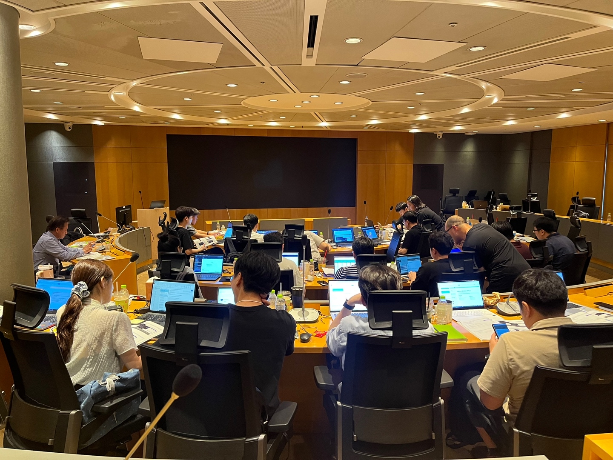
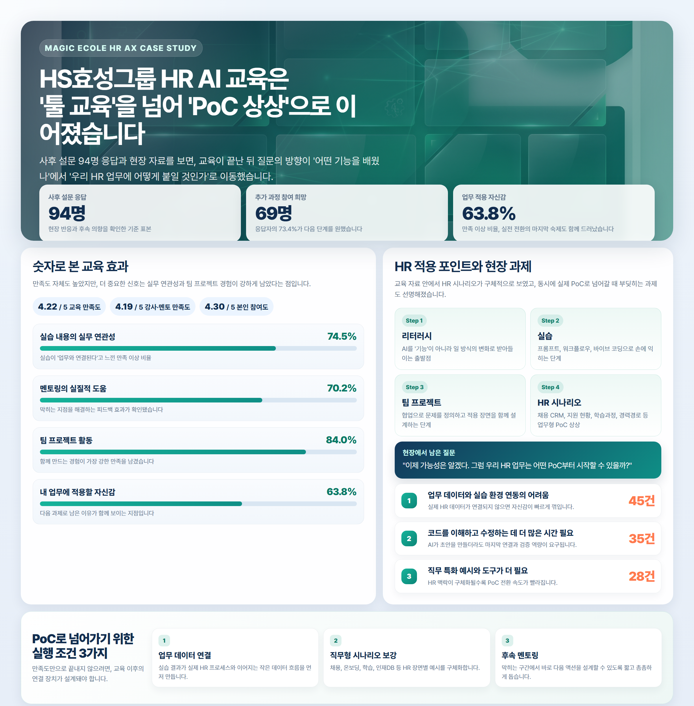

Case Study | HR AX
<h1 style="margin:16px 0 14px;font-size:34px;line-height:1.25;letter-spacing:-.03em;color:#ffffff;">HS효성그룹 HR AI 교육, '툴 교육'에서 'PoC 상상'으로</h1>
사후 설문 94명 응답과 현장 자료를 보면, 이번 교육은 단순한 기능 체험에서 멈추지 않았습니다. 교육이 끝난 뒤 참가자들이 남긴 핵심 질문은 하나였습니다. "우리 HR 업무에는 어떤 AI PoC부터 붙일 수 있을까?"

사후 설문 응답

94명

현장 반응과 후속 의향을 확인한 기준 표본

추가 과정 참여 희망

69명

응답자의 73.4%가 다음 단계를 원했습니다

업무 적용 자신감

63.8%

만족 이상 비율, 다음 과제도 함께 드러난 지점

AI 교육 사례를 이야기할 때 가장 자주 나오는 질문은 늘 비슷합니다. "좋은 교육인 건 알겠는데, 그래서 업무가 정말 바뀌는가?" 이번 HS효성그룹 HR 교육 사례가 인상적인 이유도 바로 그 지점에 있습니다.

현장 자료를 따라가 보면, 이번 교육은 리터러시에서 끝나는 구성이 아니었습니다. AI 활용을 이해하는 단계에서 출발해 실습, 프로젝트, 발표까지 이어지고, 그 과정에서 HR 업무에 바로 닿는 화면형 시나리오까지 상상할 수 있게 설계되어 있었습니다.

실습 중심으로 진행된 HS효성그룹 HR AI 교육 현장

멘토링과 발표가 함께 이어진 전문가 과정 세션

---

## 교육이 끝난 뒤 남은 질문이 달랐습니다

많은 조직의 AI 교육은 "도구를 이해했다"는 수준에서 마무리됩니다. 반면 이번 사례는 교육이 끝난 뒤의 질문이 더 앞단으로 나아갔습니다. 참가자들이 남긴 관심은 "프롬프트를 더 잘 쓰는 법"보다 "우리 HR 업무 흐름에 어떻게 붙일 것인가"에 가까웠습니다.

PPT 자료를 보면 전체 구성도 그 방향을 지지합니다. AI 리터러시로 시작해, 직무형 전문가 과정에서 AI Agent, Workflow, 바이브 코딩, 프로젝트 발표까지 이어지는 흐름은 지식을 전달하는 교육이라기보다, 실제 업무 전환의 출발점을 만드는 구조에 가깝습니다.

핵심 포인트

<strong style="color:#0b4f64;">이번 교육의 성과는 만족도 자체보다 질문의 방향이 이동했다는 점</strong>입니다. "무엇을 배웠는가"에서 "어떤 HR PoC로 이어갈 것인가"로 관심이 바뀌었습니다.

---

## 교육 안에서 HR 업무형 PoC가 보인 장면

이번 사례를 HR 관점에서 더 흥미롭게 만든 것은 교육 자료 안에 등장한 화면형 시나리오입니다. 자료에는 `Interactive Job Search CRM Demo` 형태의 예시가 포함돼 있었고, 지원 현황, 학습과정, 경력경로처럼 HR 실무와 자연스럽게 연결되는 요소들이 화면 안에 배치되어 있었습니다.

이 장면이 중요한 이유는 AI를 추상적인 가능성으로 보여주는 데 그치지 않았기 때문입니다. HR에서 AI를 쓴다는 말이 문서 요약이나 초안 작성 수준에 머무르지 않고, 지원자 관리, 인재 데이터 탐색, 경력 경로 이해처럼 실제 업무형 PoC로 상상될 수 있는 수준까지 내려왔다는 뜻이기 때문입니다.

Step 1

리터러시

AI를 기능이 아니라 일하는 방식의 변화로 이해

Step 2

실습

프롬프트와 워크플로우를 직접 손에 익히는 단계

Step 3

팀 프로젝트

문제를 정의하고 적용 장면을 협업으로 구체화

Step 4

HR 시나리오

채용 CRM과 경력경로 등 업무형 PoC 상상으로 연결

---

## 실행 가이드형으로 보면 Before / After가 분명합니다

| 구분 | 교육 이전에 흔한 상태 | 이번 교육 이후 확인된 변화 |
|---|---|---|
| AI 이해 수준 | 기능 소개와 사례 청취 중심 | 실습과 프로젝트를 통해 직접 손에 익히는 구조 |
| HR 적용 상상력 | 문서 작성 자동화 수준에 머무름 | 채용 CRM, 지원 현황, 경력경로 등 업무형 PoC까지 상상 가능 |
| 교육 종료 시점의 질문 | "무엇을 배웠는가" | "우리 HR 업무는 어디부터 붙일 것인가" |
| 다음 액션 | 교육 종료와 함께 멈춤 | 데이터 연결, 직무형 시나리오, 후속 멘토링 필요성 확인 |

이 표에서 중요한 것은 성과를 과장해서 읽는 것이 아닙니다. 오히려 이번 교육은 "좋은 교육이었다"는 평가와 함께, 실제 PoC로 이어지려면 무엇이 더 필요한지도 동시에 드러낸 사례라고 보는 편이 정확합니다.

---

## 설문으로 확인된 교육 효과

사후 설문 94명 응답 기준으로 교육 만족도 평균은 4.22점, 강사 및 멘토 만족도 평균은 4.19점, 본인 참여도 평균은 4.30점이었습니다. 추가 전문가 과정 참여를 희망한 인원도 69명으로 확인됐습니다.

실무 연관성 만족 이상 비율은 74.5%, 멘토링 도움은 70.2%, 팀 프로젝트 활동 만족은 84.0%였습니다. 교육이 단순히 "들어보는 과정"이 아니라, 함께 만들어보는 과정으로 인식되었다는 신호로 읽을 수 있습니다.

특히 눈에 띄는 부분은 만족도와 참여도 못지않게, 팀 프로젝트와 실습 연관성에 대한 반응이 높았다는 점입니다. 결국 교육 효과를 만든 것은 기능 소개보다 실습, 협업, 피드백이 결합된 경험이었다고 해석할 수 있습니다.

---

## 만족도와 별개로, 바로 다음 과제도 드러났습니다

만족도만 보면 이번 교육은 충분히 좋은 결과로 읽힙니다. 하지만 실제 업무 전환의 관점에서 보면 아직 마지막 1km가 남아 있습니다. 업무 적용 자신감의 만족 이상 비율은 63.8%였고, 이 수치는 만족도에 비해 더 현실적인 온도를 보여줍니다.

과제 1

업무 데이터 연동

실제 데이터가 연결되지 않으면 실습 결과가 업무 자신감으로 이어지기 어렵습니다.

45건

과제 2

코드 이해와 수정

AI가 초안을 만들더라도 마지막 연결과 검증은 여전히 사람의 역량이 필요합니다.

35건

과제 3

직무형 예시 보강

HR 맥락이 더 구체화될수록 교육은 PoC 구상으로 더 빠르게 넘어갈 수 있습니다.

28건

실제로 설문에서 가장 많이 언급된 어려움은 업무 데이터와 실습 환경 간 연동의 어려움, 코드를 이해하고 수정하는 데 필요한 시간, 그리고 직무에 특화된 예시 부족이었습니다. 다시 말해 이번 교육은 성공적이었지만, 동시에 "어떻게 후속 PoC를 설계할 것인가"라는 숙제를 정확히 보여준 사례이기도 합니다.

---

## HR PoC로 연결하려면 필요한 세 가지

1. 교육 직후 바로 연결할 수 있는 작은 데이터 흐름을 먼저 만들어야 합니다.
2. 채용, 온보딩, 학습, 인재DB처럼 HR 장면별 시나리오를 더 촘촘하게 제시해야 합니다.
3. 실습 이후 막히는 구간을 짧고 빠르게 해결하는 후속 멘토링이 있어야 합니다.

결국 HR AI 교육의 성패는 강의 만족도만으로 결정되지 않습니다. 교육에서 실습으로, 실습에서 업무형 PoC로 이어지는 마지막 연결을 얼마나 세밀하게 설계하느냐가 핵심입니다.

---

## 매직에꼴이 본 이번 사례의 의미

HS효성그룹 HR AI 교육 사례는 "AI 교육을 잘했다"는 이야기로만 정리하기에는 아까운 장면을 남겼습니다. 더 중요한 메시지는 교육이 끝난 뒤 참가자들이 남긴 질문이 분명해졌다는 점입니다. "이제 가능성은 알겠다. 그럼 우리 HR 업무는 어디부터 바꿔볼 수 있을까?"라는 질문 말입니다.

이 질문이 나왔다는 사실 자체가 이미 다음 단계의 출발선입니다. 교육이 PoC 상상으로 이어졌다면, 이제 필요한 것은 그 상상을 실제 업무 흐름에 연결하는 설계입니다.

우리 조직의 HR 업무, 어떤 AI PoC부터 시작해야 할까요?

매직에꼴 AX 교육과 컨설팅은 교육 효과를 실제 업무 과제로 연결하는 설계까지 함께 봅니다.

<a href="https://ax-inquiry-system.vercel.app/inquiry" style="display:inline-block;padding:12px 22px;border-radius:999px;background:#ffffff;color:#0d4d5b;text-decoration:none;font-size:15px;font-weight:800;">AX 교육 문의하기</a>

