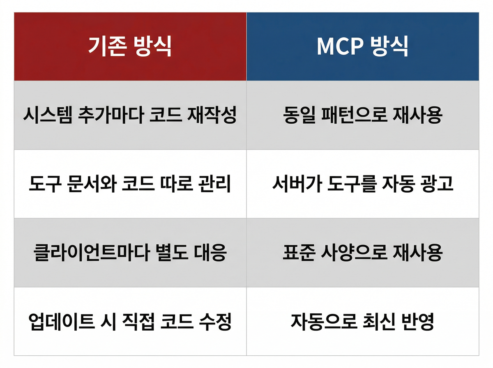
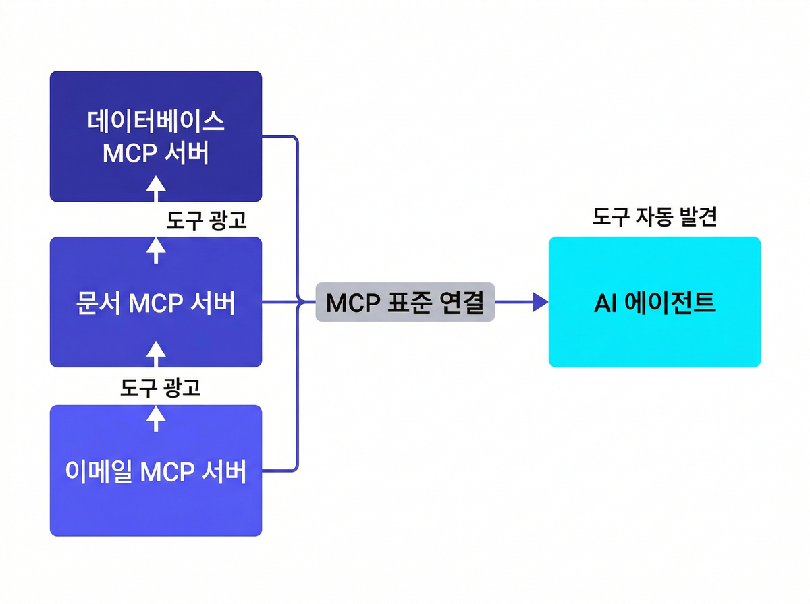

## SEO 검토 요약

제목은 실무 문제 중심으로 클릭율에 유리하나, 타겟 메인 키워드 "MCP"가 제목 후반부에 배치되어 검색 랭킹 최적화 측면에서 아쉽다. 메타 디스크립션은 128자로 권장 범위(80~120자)를 소폭 초과하고 있어 축약이 필요하다. 본문 내 내부 링크 기회가 2곳 있으나 현재 삽입되지 않아 사이트 내 체류 시간과 크롤링 연결성 강화가 가능하다.

## 항목별 피드백

| 항목 | 현재 상태 | 권고 | 우선순위 |
|---|---|---|---|
| 제목 | "AI 에이전트 붙일 때마다 코드가 쌓인다면, MCP부터 보세요" — 48자, 메인 키워드 "MCP"가 후반부 | "MCP"를 콜론 앞 또는 제목 앞부분으로 이동 (아래 대안 참조) | 중요 |
| 메타 디스크립션 | 128자 — 권장 범위(80~120자) 초과, 키워드 포함·행동유도 문구 있음 | 120자 이내로 축약 | 중요 |
| H2 헤딩 | 6개 H2 사용, 구조 명확. "MCP" 키워드는 6개 중 3개 H2에 포함 | 양호 — 추가 조정 불필요 | 권고 없음 |
| 본문 키워드 밀도 | "MCP" 약 18회 등장, 전체 본문 약 900자 기준 2% 수준 | 과최적화 경계선 — 1~2회를 대명사/주어 생략 처리로 조정 | 권고 |
| 내부 링크 | 없음 | 데이터 소스 연결 섹션 + RAG 관련 언급 위치에 기존 포스트 2개 삽입 | 긴급 |
| slug | — | `mcp-ai-agent-integration-standard` | — |

## 제목 대안 제안

현재 제목이 브랜드 보이스(실무 문제 중심)와 잘 맞지만, 검색 노출을 위해 아래 대안 중 하나를 권고한다.

**대안 A** (현재 톤 유지 + 키워드 보강):
> `AI 에이전트 붙일 때마다 코드가 쌓인다면: MCP 연결 표준 실무 가이드`

**대안 B** (메인 키워드 앞 배치, 질문형 유지):
> `MCP란 무엇인가: AI 에이전트 연결 코드가 쌓일 때 보는 표준`

**대안 C** (숫자 활용 + 키워드 앞 배치):
> `MCP 기업 도입 전 확인할 3가지: 에이전트 연결 표준이 필요한 시점`

> 권고: 대안 A가 현재 제목의 브랜드 톤을 가장 잘 유지하면서 콜론 뒤에 "MCP"를 명시해 검색 인식도를 높인다.

## 메타 디스크립션 개선안

**현재 (128자):**
AI 에이전트를 사내 시스템에 연결할수록 코드가 쌓이고 유지보수가 막막해진다면, MCP가 그 반복 비용을 줄이는 방식을 소개합니다. 10,000개 서버와 주요 빅테크가 채택한 연결 표준의 실무 의미를 짚어봅니다.

**개선안 (111자):**
AI 에이전트 연결할수록 코드만 쌓인다면, MCP를 확인하세요. 10,000개 서버·빅테크가 채택한 에이전트 통합 표준의 실무 의미를 짚어봅니다.

## 내부 링크 삽입 권고

| 삽입 위치 | 링크 텍스트 | 대상 URL |
|---|---|---|
| "MCP가 이 문제를 푸는 방식" 섹션 — 데이터 소스 연결 언급 부분 | AI 데이터 준비도 점검 방법 | /blog/ai-data-readiness-checklist |
| "서버가 도구를 광고하고, 에이전트가 찾아 쓴다" 섹션 — 지식 소스 검색·연결 맥락 | RAG·GraphRAG 기반 지식 연결 | /blog/rag-basic-advanced-graphrag-guide |

**삽입 예시:**

> MCP는 AI 어시스턴트와 데이터 저장소, 비즈니스 툴, 개발 환경을 연결하는 개방형 표준입니다. 데이터 소스 자체를 AI가 활용할 수 있는 상태로 만드는 준비가 선행되어야 한다면, [AI 데이터 준비도 점검 방법](/blog/ai-data-readiness-checklist)도 함께 참고해보세요.

## slug 제안

`mcp-ai-agent-integration-standard`

---

## 추가 권고 (이미지 SEO)

이미지 생성 단계 완료 후 아래 형식으로 alt 텍스트를 반드시 추가한다.

```markdown



```
