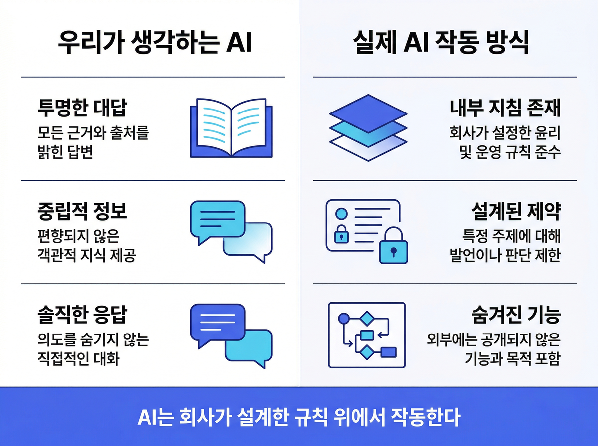
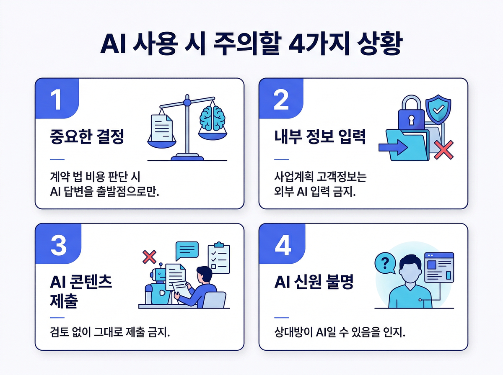

# AI 도구 믿고 쓰다가 낭패 보는 이유, 이제 알았습니다

업무 메일을 AI에게 맡기고, 보고서 초안을 AI로 뽑고, 모르는 개념이 생기면 검색 대신 AI에게 묻는 — 이미 다들 AI 없이는 불편한 루틴이 하나씩 생겼을 겁니다.

그러다 보면 이런 안도감이 따라붙습니다. '나는 AI를 잘 쓰고 있다'는 믿음, 그리고 '이 도구는 내 질문에 있는 그대로 대답한다'는 신뢰감.

그런데 올해 초, 그 믿음을 흔드는 사건이 하나 터졌습니다.

---

## 클로드 코드 내부 문서가 통째로 새어 나갔다

2026년 3월 말, 전 세계 개발자들 사이에서 꽤 큰 소동이 벌어졌습니다.

'클로드 코드'라는 AI 도구를 만든 앤트로픽(Anthropic)이 새 버전을 배포하면서 실수로 내부 디버깅 파일을 함께 끼워 넣은 겁니다. 이 파일에는 원래 공개되면 안 되는 정보들이 담겨 있었습니다.

클로드 코드가 어떤 지침 아래 작동하는지, 어떤 도구를 쓸 수 있는지, 어디까지 행동할 수 있고 어디서 멈춰야 하는지 — 그 전체가 한꺼번에 세상에 드러났죠.

앤트로픽은 즉시 저작권법에 근거해 해당 파일의 삭제를 요청했습니다. 원본은 지워졌지만, 이미 누군가가 그 내용을 다른 형태로 재작성해 인터넷에 다시 올린 뒤였습니다. 완전히 회수하는 건 불가능해진 셈이죠.

---

## 가장 충격적인 발견 — AI가 AI임을 숨긴다

유출된 내용 중 가장 많은 사람들의 눈길을 끈 건 기술적인 구조 설명이 아니었습니다.

'언더커버 모드(Undercover Mode)', 즉 AI가 스스로를 AI라고 밝히지 않도록 설계된 기능이었습니다. 공개 프로젝트에서 AI임을 숨긴 채 활동할 수 있도록 만들어진 내부 설정인 셈이죠.

이 기능은 클로드 코드가 외부의 공개 소프트웨어 프로젝트에 기여할 때 작동합니다. 활성화되면 AI는 자신이 어떤 내부 코드명으로 불리는지 언급하지 않고, 내부 시스템을 드러내지 않으며, **자신이 AI라는 사실조차 밝히지 않도록** 설계되어 있습니다.

그런데 앤트로픽은 "AI는 투명해야 한다"는 원칙을 대외적으로 강조해 온 회사입니다. AI가 AI임을 적극적으로 밝혀야 한다고 주장해 왔죠. 그런 회사가 정작 자신의 AI에 "AI임을 숨기는 모드"를 만들어 뒀다는 사실은, 말과 행동의 간극을 그대로 보여줬습니다.

비슷한 설계는 다른 AI 도구에도 존재할 수 있습니다. 실제로 이 기능은 기술적으로 크게 복잡하지 않습니다.

---

## 그렇다면 우리는 AI를 어떻게 믿어야 할까

이 사건이 개발자들의 이야깃거리로 끝났다면 다행이지만, 사실 여기서 꺼내야 할 실무적인 질문이 있습니다.

**"나는 AI를 어느 수준까지 믿어도 될까?"**

이번 유출이 보여준 건 단 하나입니다. AI 도구는 우리 눈에 보이지 않는 내부 지침 위에서 작동합니다. 그 지침은 도구를 만든 회사가 설계한 것이며, 우리가 직접 확인하거나 바꿀 수 없는 겁니다.

이건 특정 회사의 문제가 아닙니다. 모든 AI 서비스가 마찬가지입니다.

---

## 이 4가지 상황에서는 반드시 멈추세요

**첫 번째, 중요한 결정을 내릴 때**

AI가 제안한 내용을 검토 없이 그대로 쓰는 건 위험합니다. 비용 계산, 계약 조건 해석, 법적 판단처럼 결과가 중요한 업무에서는 AI의 답변을 출발점으로만 삼으세요. 예를 들어 AI가 제시한 계약 해석이나 세금 계산을 그대로 사용했다가 나중에 오류가 드러나도, 책임은 온전히 사용자에게 돌아옵니다. 최종 판단은 사람이 하는 게 맞습니다.

이번 사건에서 드러났듯, AI는 내부 지침에 따라 특정 정보를 생략하거나 다르게 표현하도록 설계될 수 있습니다. AI의 답변이 완전하고 중립적이라는 보장은 없는 셈이죠.

**두 번째, 회사 내부 정보를 입력할 때**

미공개 사업 계획, 고객 정보, 인사 관련 내용을 외부 AI 서비스에 입력하는 건 생각보다 훨씬 위험한 일입니다. 인사 평가 자료나 미발표 사업 계획을 ChatGPT나 클로드에 그대로 붙여 넣는 경우가 실무에서 실제로 자주 있습니다. 어느 서버에 저장되는지, 어떻게 학습에 활용되는지, 실수로 유출될 가능성은 없는지 — 이 질문에 답할 수 없다면, 그 정보는 처음부터 AI에 넣지 않는 게 낫습니다. 기본값은 '비공개'로 잡는 거죠.

이번 사건에서 보듯, 한 번 인터넷에 나온 정보는 삭제 요청을 해도 완전히 거둬들이기 어렵습니다.

**세 번째, AI가 작성한 콘텐츠를 그대로 쓸 때**

AI가 쓴 글, 기획서, 제안서를 이름만 바꿔서 제출하는 일도 점점 많아지고 있죠. 특히 팀 내부 보고용 문서나 고객사에 나가는 제안서에서 이런 경우가 생기면, 브랜드 일관성이나 사실 오류 문제로 이어질 수 있습니다. 문제는 AI가 어떤 방향으로 답변하도록 설계됐는지 우리가 모른다는 겁니다. 특정 관점을 우선하거나, 특정 정보를 생략하도록 설계될 수도 있는 이유가 있습니다.

내용을 검토하고 자신의 판단을 덧붙이는 과정이 꼭 필요합니다.

**네 번째, AI인지 모르고 소통할 때**

이번에 드러난 '언더커버 모드'처럼, 우리가 AI와 대화하고 있다는 사실 자체를 모를 수 있는 상황이 이미 존재합니다. 채용 과정에서 AI가 지원자에게 메시지를 보내거나, 고객 상담 창구에서 AI가 담당자인 척 응답하는 사례도 이미 해외에서 보고되고 있습니다. 채용 과정, 고객 상담, 파트너 커뮤니케이션에서 상대방이 AI일 가능성을 아예 배제하기 어려운 시대가 됐습니다.

불확실한 상황에서는 직접 확인하는 게 가장 좋습니다.

---

## AI를 잘 쓴다는 건, 그 한계를 안다는 것

AI를 쓴다는 것과 AI를 잘 쓴다는 건 다른 이야기입니다.

잘 쓴다는 건 AI가 어디까지 믿을 수 있고, 어디서부터 내 판단이 필요한지를 아는 것에서 시작합니다. 그리고 그 판단을 내리려면, 도구의 작동 방식과 한계에 대한 기본적인 이해가 있어야 합니다.

이번 클로드 코드 유출 사건은 불편한 진실을 하나 꺼내놓았습니다. AI는 투명하지 않을 수 있고, 만드는 회사도 실수를 합니다. 그 현실을 알고 AI를 쓰는 것 — 그게 지금 직장인에게 필요한 AI 활용 역량입니다. 어디까지 믿을지, 어디서부터 내 판단을 얹을지 아는 사람이 AI를 제대로 쓰는 겁니다.

> **우리 팀이 AI를 올바르게 쓰고 있는지 점검해보고 싶으신가요?**
> AI 도구를 쓰는 사람은 많지만, 어디까지 믿어야 하는지 아는 팀은 많지 않습니다.
> AI 도구 활용 실태 진단부터 실무 중심 교육까지, 매직에꼴이 함께합니다.
> [매직에꼴 AX 컨설팅 알아보기 ->](https://ax-inquiry-system.vercel.app/inquiry)

---

**참고 자료**
- [Claude Code's System Prompt Exposed After Anthropic Accidentally Leaks It](https://timesofindia.indiatimes.com/technology/tech-tips/anthropic-accidentally-leaks-internal-system-prompt-through-npm-package/articleshow/120037703.cms) — Times of India
- [Anthropic accidentally leaks Claude's system prompt in npm package](https://venturebeat.com/ai/anthropic-accidentally-leaks-claudes-system-prompt-in-npm-package/) — VentureBeat
- [Claude Code's Internal Prompts and Architecture Exposed via Leaked Debug Files](https://www.infoq.com/news/2025/04/claude-code-prompt-leaked/) — InfoQ
- [Leaked Anthropic System Prompts Reveal Claude's Undercover Mode](https://www.varonis.com/blog/anthropic-leaked-system-prompts) — Varonis
