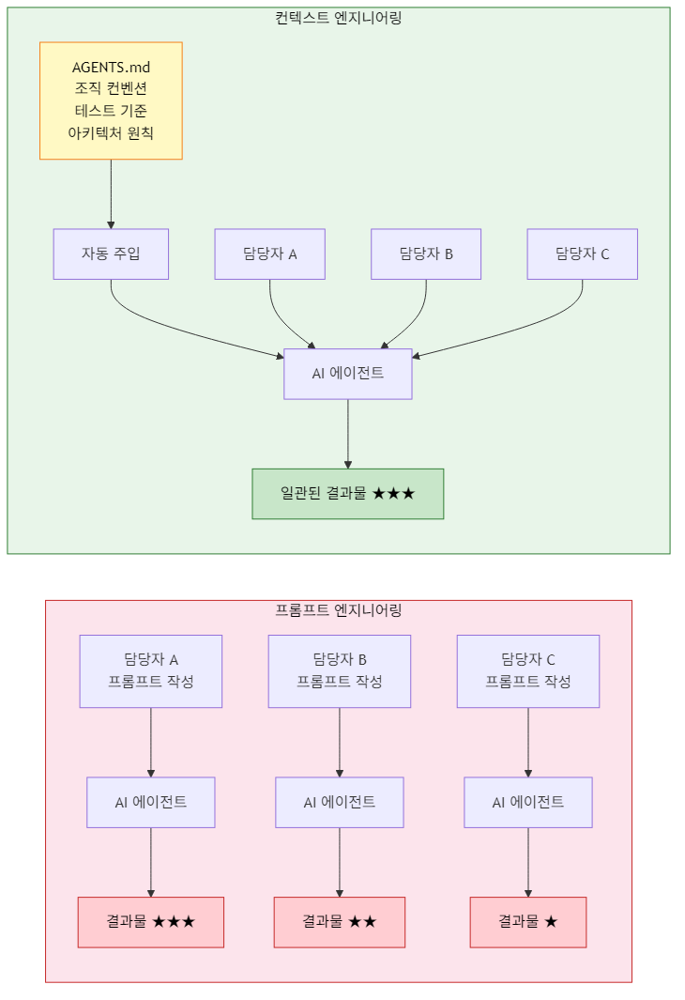
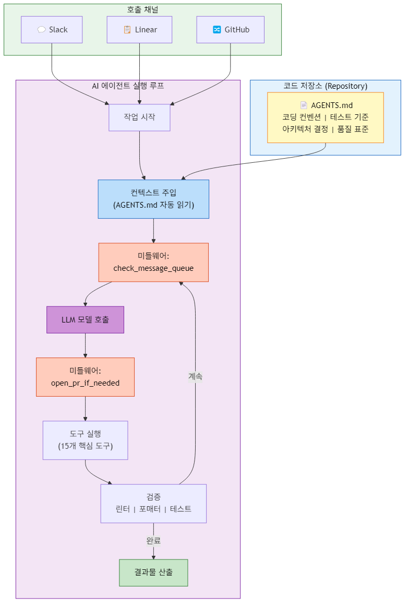

# 컨텍스트 엔지니어링이란? AI 에이전트에게 '우리 팀의 방식'을 가르치는 법

---

## 컨텍스트 엔지니어링, 왜 지금 주목해야 하는가?

AI 에이전트를 업무에 도입하는 조직이 빠르게 늘고 있다. 그러나 많은 조직이 동일한 벽에 부딪힌다. **컨텍스트 엔지니어링(Context Engineering)**의 부재라는 벽이다. AI에게 작업을 맡기면 "기술적으로는 맞지만 우리 방식은 아닌" 결과물이 나온다. 코드 스타일이 다르고, 문서 톤이 다르고, 의사결정 기준이 다르다.

이 문제의 근본 원인은 단순하다. 우리는 AI에게 "무엇을 하라"고만 지시했지, "우리 팀이 일하는 방식"을 가르치지 않았다. 프롬프트 엔지니어링이 일회성 지시의 기술이라면, 지금 필요한 것은 조직의 지식 체계를 AI가 이해할 수 있는 구조로 설계하는 역량이다. 이것이 바로 컨텍스트 엔지니어링이다.

실리콘밸리 선도 기업들은 이미 이 문제를 인식하고 해법을 실행에 옮기고 있다. Stripe는 Minions를, Ramp는 Inspect를, Coinbase는 Cloudbot이라는 내부 코딩 에이전트를 각각 독립적으로 구축했다. 흥미로운 점은, 서로 다른 조직이 독립적으로 개발했음에도 유사한 아키텍처 패턴으로 수렴했다는 사실이다. LangChain은 이 공통 패턴을 분석하여 오픈소스 프레임워크 Open SWE로 공개했다.

---

## Open SWE와 AGENTS.md — 선도 기업들의 컨텍스트 엔지니어링 사례

Open SWE의 7가지 핵심 아키텍처 중 특히 주목해야 할 것은 네 번째 요소, **컨텍스트 엔지니어링**이다.

그 메커니즘은 놀라울 정도로 직관적이다. 코드 저장소(repository)의 루트에 `AGENTS.md`라는 파일을 배치하면, AI 에이전트가 작업을 시작할 때 이 파일을 자동으로 읽어 시스템 프롬프트에 주입한다. 이 파일에는 코딩 컨벤션, 테스트 요구사항, 아키텍처 결정 사항 등 조직의 개발 표준이 담긴다.

이것이 기존 프롬프트 엔지니어링과 근본적으로 다른 이유는 다음과 같다.

**프롬프트 엔지니어링**은 매번 개별 작업자가 적절한 지시를 작성해야 하는 **일회성 지시** 모델이다. 담당자의 역량에 따라 결과 품질이 들쭉날쭉하고, 조직의 표준이 체계적으로 반영되기 어렵다.

**컨텍스트 엔지니어링**은 조직의 암묵지와 컨벤션을 **구조화된 문서**로 정리하여 AI에 자동으로 주입하는 **체계적 지식 구조화** 모델이다. 한 번 설계하면 모든 팀원이 동일한 수준의 AI 결과물을 받을 수 있다.

Open SWE의 아키텍처에서 컨텍스트 엔지니어링과 함께 주목할 요소는 **미들웨어(Middleware)** 패턴이다. 이는 결정론적 로직을 에이전트의 실행 루프에 주입하는 방식으로, 예를 들어 `check_message_queue_before_model`(모델 호출 전 메시지 큐 확인)이나 `open_pr_if_needed`(필요시 PR 자동 생성)와 같은 규칙을 에이전트에 내장한다. 컨텍스트 엔지니어링이 "무엇을 알아야 하는가"를 정의한다면, 미들웨어는 "어떤 절차를 따라야 하는가"를 정의한다. 이 두 요소의 결합이 AI 에이전트를 단순한 도구에서 "조직의 방식을 아는 동료"로 전환시키는 핵심 구조로 분석된다.

또한 Open SWE의 도구(Tool) 설계 철학도 시사적이다. Stripe는 약 500개의 도구를 운용하고 있지만, Open SWE는 약 15개의 핵심 도구만 큐레이션하며 "품질이 중요하다"는 원칙을 따른다. 이는 AI에게 더 많은 도구를 주는 것이 아니라, 잘 정제된 도구와 정확한 맥락을 제공하는 것이 더 효과적이라는 점을 보여준다.

---

## 컨텍스트 엔지니어링의 3가지 핵심 인사이트

### 1. 컨텍스트 엔지니어링은 프롬프트 엔지니어링의 "다음 단계"가 아니라 "다른 차원"이다

프롬프트 엔지니어링이 개인 역량에 의존하는 전술적 기술이라면, 컨텍스트 엔지니어링은 조직 역량으로 축적되는 전략적 자산이다. `AGENTS.md`에 담긴 코딩 컨벤션, 테스트 기준, 아키텍처 원칙은 한 번 정리되면 조직 전체의 AI 활용 수준을 균일하게 끌어올린다. 개별 프롬프트의 품질에 의존하지 않으면서도 일관된 결과물을 확보할 수 있는 구조적 접근이다.

### 2. AGENTS.md 방식은 소프트웨어 개발을 넘어 확장될 수 있다

현재 `AGENTS.md`는 코딩 에이전트를 위한 메커니즘이지만, 이 패턴의 본질은 "조직의 암묵지를 AI가 소비할 수 있는 형태로 명문화하는 것"이다. 소스의 코딩 에이전트 사례에서 한 걸음 더 나아가 우리의 분석을 제시하면, 이 원리는 본질적으로 업무 영역을 가리지 않는다.

- **마케팅**: 브랜드 보이스 가이드, 타겟 페르소나, 콘텐츠 컨벤션을 구조화하여 AI 콘텐츠 에이전트에 주입
- **HR**: 채용 기준, 평가 프레임워크, 조직문화 원칙을 구조화하여 AI HR 어시스턴트에 주입
- **컨설팅**: 방법론, 프레임워크 활용 원칙, 산출물 표준을 구조화하여 AI 분석 에이전트에 주입

각 영역의 전문가가 자신의 암묵지를 AI가 이해할 수 있는 구조적 문서로 변환하는 역량이 AX 시대의 핵심 경쟁력으로 부상할 것으로 예측된다.

### 3. 조직의 AI 성숙도는 "컨텍스트 자산"의 축적 수준으로 측정될 수 있다

Open SWE에서 관찰되는 패턴 — 컨텍스트 문서(`AGENTS.md`) + 미들웨어(절차 규칙) + 큐레이션된 도구 — 은 사실상 조직 지식의 디지털 자산화 과정이다. AI 에이전트에게 전달할 수 있는 컨텍스트가 풍부하고 정교한 조직일수록, AI로부터 더 높은 수준의 결과물을 이끌어낼 수 있다. 이는 AI 도구 자체보다 "AI에 무엇을 가르칠 수 있는가"가 차별화 요소가 된다는 것을 의미한다.

---

## AI 에이전트 도입을 위한 4가지 실무 전략

Open SWE의 사례에서 도출할 수 있는 실무적 시사점은 다음과 같다.

**첫째, 조직의 암묵지를 체계적으로 명문화하는 작업을 시작해야 한다.** 코딩 컨벤션뿐 아니라 의사결정 기준, 품질 표준, 커뮤니케이션 원칙 등 "당연하다고 여겨져 온 것들"을 문서로 정리하는 것이 AI 활용의 출발점이 된다. 이는 단순 문서화가 아니라 AI가 소비할 수 있는 구조화된 형태로의 전환을 의미한다.

**둘째, 미들웨어 사고방식을 도입해야 한다.** AI 에이전트에게 지식을 전달하는 것만으로는 충분하지 않다. Open SWE의 미들웨어 패턴처럼, 조직의 워크플로우에서 반복되는 점검 사항과 절차적 규칙을 AI 실행 루프에 내장하는 설계가 필요하다. "모델 호출 전 반드시 확인해야 할 것", "결과물 생성 후 반드시 거쳐야 할 검증"을 체계화하는 것이다.

**셋째, 도구의 양보다 맥락의 질에 집중해야 한다.** Stripe가 500개의 도구를 운용하면서도 Open SWE가 15개의 핵심 도구만 큐레이션한 사실은, AI 활용의 성패가 도구의 수가 아니라 도구에 제공하는 맥락의 정교함에 달려 있음을 시사한다. 조직은 AI 도구를 무분별하게 도입하기보다, 핵심 업무에 맞는 도구를 선별하고 풍부한 컨텍스트를 설계하는 데 자원을 투자해야 한다.

**넷째, 컨텍스트 엔지니어링을 전담할 역할을 고려해야 한다.** `AGENTS.md`를 잘 작성하려면 해당 업무의 전문성과 AI 시스템에 대한 이해가 모두 필요하다. 이는 기존의 프롬프트 엔지니어보다 더 깊은 조직 이해를 요구하는 역할이며, AX 추진 조직에서 핵심 포지션으로 자리 잡을 가능성이 전망된다.

---

## AX 시대, AI에게 무엇을 가르칠 것인가

AI 에이전트의 시대가 열리고 있다. 그러나 같은 AI 모델을 사용하더라도 조직마다 결과물의 수준은 크게 다를 수밖에 없다. 그 차이를 만드는 것은 AI 모델의 성능이 아니라, 조직이 AI에게 전달할 수 있는 컨텍스트의 깊이와 구조이다.

Stripe, Ramp, Coinbase 같은 선도적 엔지니어링 조직들이 독립적으로 도달한 결론, 그리고 Open SWE가 오픈소스로 정리한 아키텍처 패턴은 하나의 방향을 가리킨다. **AI에게 좋은 지시를 내리는 것을 넘어, 조직의 지식 체계를 AI가 이해할 수 있는 구조로 설계하라.** 이것이 컨텍스트 엔지니어링이고, AX를 실질적인 경쟁력으로 전환하는 핵심 역량이다.

지금 해야 할 질문은 "어떤 AI 도구를 도입할 것인가"가 아니라, **"우리 조직의 방식을 AI에게 어떻게 가르칠 것인가"**이다.

---

**소스 크레딧**
- Open SWE — 내부 코딩 에이전트를 위한 오픈소스 프레임워크 (AI Factory / LangChain 블로그 번역 요약)
