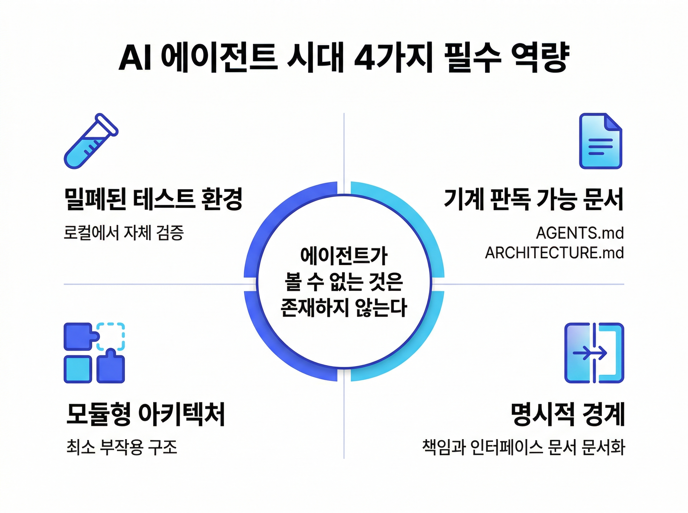

# 코드를 짜는 엔지니어는 사라진다 — OpenAI Harness Engineering이 증명한 것

AI 코딩 도구를 도입하면 생산성이 오를까요? 대부분의 기업이 이 질문에서 출발합니다. 하지만 답은 "아니오"에 가깝습니다. 도구가 아니라 조직이 문제입니다.

OpenAI가 5개월간 진행한 실험이 이를 증명했습니다. 수동으로 코드를 한 줄도 작성하지 않고 백만 라인의 소프트웨어를 구축한 것입니다.

## 왜 지금 이 실험에 주목해야 하는가?

2026년 2월, OpenAI는 Harness Engineering을 공식 발표했습니다. 3월에는 이를 구현한 오픈소스 오케스트레이터 Symphony를 공개했습니다.

Symphony 자체는 도구에 불과합니다. 진짜 주목할 것은 배경 방법론입니다. "사람은 조정하고, 에이전트는 수행한다." 이것이 핵심 원칙입니다.

기존에는 개발자가 AI 도구를 직접 실행했습니다. Cursor, Claude Code, Codex 등을 일일이 관리했죠. Harness Engineering은 이 구조를 뒤집습니다. 이슈만 등록하면 AI가 알아서 처리합니다.

> **핵심**: AI 코딩 에이전트의 진짜 가치는 코딩이 아닙니다. 엔지니어의 역할을 재정의하는 것입니다.

그렇다면 실제로 어떤 결과가 나왔을까요?

## OpenAI 실험이 보여준 구체적 성과

실험 결과는 놀랍습니다. 숫자로 확인해보겠습니다.

| 지표 | 수치 |
|---|---|
| 코드 규모 | 백만 라인 (5개월) |
| 팀 규모 | 초기 3명 → 현재 7명 |
| PR 처리량 | 1인당 하루 3.5개 |
| 개발 속도 | 수동 대비 약 10배 |

엔지니어의 업무도 완전히 달라졌습니다.

| 구분 | 기존 방식 | Harness Engineering |
|---|---|---|
| 코드 작성 | 엔지니어 직접 수행 | AI 에이전트 전담 |
| 코드 리뷰 | 동료 개발자 간 수행 | 에이전트 간 처리 |
| 버그 수정 | 수동 재현 → 수정 | 에이전트가 재현·수정·검증 |
| 핵심 역할 | 코드 작성자 | 환경 설계자 |

아래 인포그래픽에서 기존 방식과 Harness Engineering의 차이를 한눈에 확인할 수 있습니다.

이 변화를 가능하게 한 전제 조건이 있습니다.

## 성공의 전제 조건 — 4가지 필수 역량

OpenAI 실험에서 가장 의미 있는 통찰은 이것입니다. "에이전트가 볼 수 없는 것은 존재하지 않는 것이다."

Slack 대화, 구두 브리핑, 머릿속 판단. AI에게는 모두 없는 것입니다. 오직 코드, 마크다운, 스키마만 인식합니다. 문서화되지 않은 지식은 자산이 아닙니다. AI 활용의 장애물입니다.

아래 인포그래픽이 4가지 필수 역량의 전체 구조를 보여줍니다.

이 원칙 위에 4가지 전제 조건이 세워집니다.

**첫째, 밀폐된 테스트 환경입니다.** 외부 서버나 DB 없이 로컬에서 돌아가는 테스트가 필요합니다. AI가 결과를 스스로 검증해야 하기 때문입니다.

**둘째, 기계 판독 가능 문서입니다.** AGENTS.md, ARCHITECTURE.md 같은 표준 문서를 갖춰야 합니다. AI가 프로젝트를 자율적으로 파악하는 기반입니다.

**셋째, 모듈형 아키텍처입니다.** 부작용이 최소화된 코드 구조가 필요합니다. 명확한 계층과 의존성 방향이 정의되어야 합니다.

**넷째, 명시적인 경계입니다.** 각 모듈의 책임과 인터페이스가 문서로 정의되어야 합니다.

우리 조직은 이 중 몇 가지를 갖추고 있나요?

전제 조건을 이해했다면, 이제 실무에서 무엇을 해야 하는지 살펴보겠습니다.

## 개발 조직 AX, 어디서부터 시작할 것인가

> **핵심**: AI 도입의 성패는 도구 선택이 아니라 조직 구조에 달려 있습니다.

많은 기업이 AI 코딩 도구를 도입합니다. 라이선스를 구매하고 개발자에게 배포합니다. 그런데 생산성은 그대로입니다. OpenAI 실험이 보여준 현실은 다릅니다.

AI 코딩 에이전트를 "쓰는" 것과 AI가 "일하는 환경을 만드는" 것은 다릅니다. 전자는 개인 스킬 문제입니다. 후자는 조직 역량 문제입니다.

**지금 당장 할 수 있는 3가지가 있습니다.**

**1. 보이지 않는 지식을 찾으세요.** 구두나 메신저로만 공유되는 지식이 얼마나 되는지 파악하세요. AI가 활용할 수 있는 지식의 비율을 진단하는 것이 첫걸음입니다.

**2. 엔지니어링 체질을 개선하세요.** 밀폐된 테스트, 모듈형 아키텍처, 표준 문서 체계. AI 도입 여부와 무관하게 좋은 실천입니다. AI 시대에는 선택이 아닌 필수가 됩니다.

**3. 엔지니어 역할을 재정의하세요.** "코드를 작성하는 사람"과 "AI 작업 환경을 설계하는 사람". 어떤 정의를 선택하느냐에 따라 조직의 궤적이 달라집니다. HR과 개발 리더십이 함께 논의해야 합니다.

**주의할 함정이 있습니다.** Harness Engineering은 초기 설정 비용이 상당합니다. 준비 없이 도구만 도입하면 효과가 떨어집니다. 기반 없는 도구 도입이 가장 위험한 함정입니다.

우리 조직의 AX 준비 수준이 궁금하다면, 매직에꼴의 AX 진단을 통해 현재 위치를 확인해볼 수 있습니다.

## 지금 움직이지 않으면, 격차는 벌어집니다

AI가 코드를 짜는 시대는 이미 시작됐습니다. 준비된 조직은 10배 빠르게 움직이고 있습니다. 준비되지 않은 조직은 여전히 도구 선택을 고민하고 있죠.

문서화, 테스트 환경, 아키텍처, 역할 재정의. 어디서부터 손대야 할지 막막하다면, 혼자 고민할 필요 없습니다.

매직에꼴은 50개 이상의 기업과 함께 AX 전략을 설계해왔습니다. 우리 조직에 맞는 출발점을 함께 찾아드립니다.

---

> **우리 조직의 AX, 어디서부터 시작할까요?**
> [매직에꼴 AX 컨설팅 알아보기 →](https://ax-inquiry-system.vercel.app/inquiry)

---

**참고 자료**
- [Harness Engineering: 에이전트 우선 세계에서 Codex 활용하기](https://openai.com/ko-KR/index/harness-engineering/)
