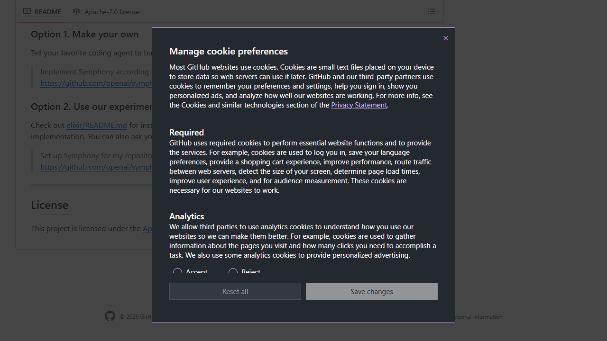
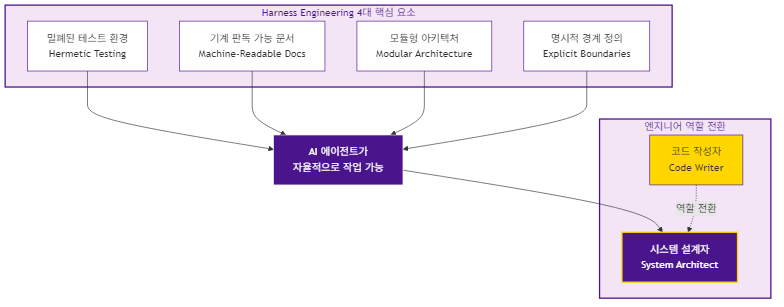
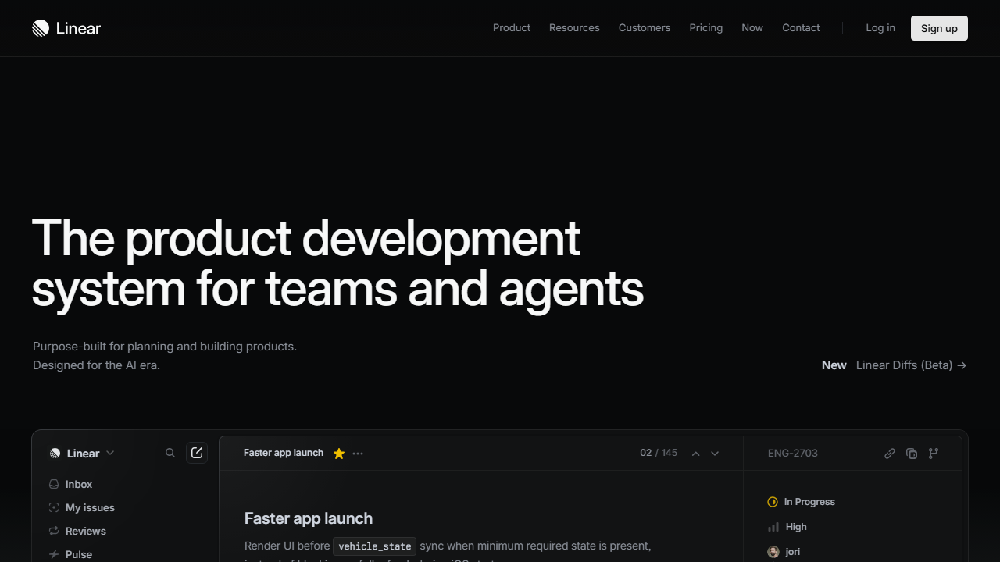

# AI 코딩 에이전트 시대, 엔지니어 역할은 어떻게 바뀌나 — Harness Engineering 실험이 보여준 것

## AI 코딩 에이전트, 왜 지금 주목해야 하나?

2026년 2월, OpenAI는 AI 코딩 에이전트를 활용한 개발 방법론인 Harness Engineering을 기술 문서로 공개했습니다. 이어 3월에는 이 방법론을 구현한 오픈소스 오케스트레이터 Symphony를 공개하며 기술 커뮤니티에 조용하지만 깊은 파장을 일으키고 있죠. Symphony 자체보다 더 주목해야 할 것은, 이 도구의 배경에 깔린 방법론 — Harness Engineering입니다. OpenAI 팀은 이 방법론을 5개월간 실험하면서 한 가지 극단적인 규칙을 적용했습니다. "수동으로 코드를 한 줄도 작성하지 않는다."

결과가 흥미롭죠. 초기 3명, 현재 7명의 엔지니어로 구성된 팀이 백만 라인의 코드를 가진 소프트웨어 제품을 구축했습니다. 엔지니어 1인당 하루 평균 3.5개의 PR을 처리하며, 수동 작성 대비 약 10배 빠른 개발 속도를 달성했죠.

이 실험이 던지는 질문은 단순히 "AI가 코드를 잘 짜는가?"가 아닙니다. "코드를 AI가 짜는 세상에서, 엔지니어는 무엇을 하는 사람인가?"라는 보다 근본적인 물음이죠. 그리고 이 질문은 개발팀만의 문제가 아니라, 조직 구조와 경영 전략 전체에 걸친 문제입니다. 이 글에서는 Harness Engineering 실험의 구체적 내용과 개발 조직 AX의 시작점을 정리합니다.

## Harness Engineering 실험 — 코드를 짜지 않는 개발팀의 실체

*출처: https://github.com/openai/symphony*

OpenAI의 실험을 구체적으로 들여다보면, 변화의 윤곽이 드러납니다.

**"사람은 조정하고, 에이전트는 수행한다"**

Harness Engineering의 핵심 원칙이죠. 이 구조에서 엔지니어는 더 이상 코드를 직접 작성하지 않습니다. 대신 업무 관리 도구인 Linear에 작업을 정의하면, AI 코딩 에이전트(Codex)가 자동으로 코드를 작성하고, 테스트하고, PR을 생성합니다. Symphony라는 오케스트레이터가 이 전체 과정을 조율하죠.

이 모델에서 엔지니어의 역할은 코드 작성에서 환경 설계, 의도 명시, 피드백 루프 구축으로 이동했습니다. 에이전트가 코드 리뷰까지 처리하죠. 버그 수정도 에이전트가 직접 재현하고, 수정하고, 검증합니다.

**암묵지가 사라지는 세계**

흥미로운 점은, 이 실험에서 드러난 가장 의미심장한 통찰이 단 한 문장에 담겨 있다는 겁니다. "에이전트가 볼 수 없는 것은 존재하지 않는 것이다."

Google Docs의 기획 문서, Slack에서 오간 맥락, 시니어 개발자 머릿속의 아키텍처 판단. AI 에이전트에게는 이 모든 것이 존재하지 않죠. 오직 리포지토리 내의 버전 관리되는 아티팩트 — 코드, 마크다운, 스키마만이 AI가 인식할 수 있는 세계입니다.

이것은 단순한 기술적 제약이 아닙니다. 조직이 수십 년간 축적해온 암묵지(tacit knowledge)의 가치가, AI 시대에는 근본적으로 재평가된다는 뜻이죠. 문서화되지 않은 지식은 조직의 자산이 아니라 AI 활용의 장애물이 되는 셈입니다.

**Harness Engineering이 요구하는 것들**

OpenAI가 이 실험을 성공시키기 위해 갖추어야 했던 전제 조건들은 곧 AI 시대 개발 조직의 필수 역량이기도 합니다.

먼저, **밀폐된 테스트(Hermetic Testing)** 환경이 필요합니다. 쉽게 말해, 외부 서버나 DB에 의존하지 않고 로컬에서 온전히 돌아가는 테스트 환경이죠. AI가 작업 결과를 스스로 검증할 수 있어야 하니까요.

그 다음은 **기계 판독 가능 문서**입니다. 프로젝트의 규칙과 구조를 정리한 표준 문서(AGENTS.md, ARCHITECTURE.md 같은)를 갖춰야 AI가 프로젝트를 자율적으로 파악할 수 있습니다.

여기에 **모듈형 아키텍처**도 빠질 수 없죠. 부작용이 최소화된 코드 구조, 명확한 계층과 의존성 방향이 정의되어야 합니다. 마지막으로, 각 모듈의 책임과 인터페이스가 문서로 정의된 **명시적인 경계**가 필수입니다.

핵심을 짚어보자면, Harness Engineering은 단순히 "AI 코딩 도구를 잘 쓰는 방법"이 아니라는 점이 중요합니다. 이것은 소프트웨어 엔지니어링 자체의 품질 기준을 한 단계 끌어올리는 방법론이죠.

## 개발 조직 AX, 우리가 놓치고 있는 진짜 변화

**AI 자동화 도입은 도구 교체가 아니라 조직 재설계입니다.**

현장에서 가장 많이 듣는 고민은 이겁니다. "AI 코딩 도구를 도입하면 생산성이 올라가겠지?" 다양한 AI 코딩 도구를 도입하고 라이선스를 구매하면 개발 생산성이 올라갈 것이라 기대하죠. 그러나 OpenAI의 실험이 보여주는 현실은 다릅니다.

Harness Engineering이 효과를 발휘하려면, 프로젝트 구조 재설계, 문서화 표준 수립, 자동화 도구 구축이라는 초기 설정 비용이 필요합니다.

개발 생산성 향상은 '도구 선택'의 문제가 아닙니다. 조직의 일하는 방식 전체를 재설계하는 경영 의사결정의 문제죠.

본질적으로는, 이것이 바로 AX(AI Transformation)의 핵심입니다. AI 코딩 에이전트를 "쓰는" 것과 AI 코딩 에이전트가 "일하는 환경을 만드는" 것은 전혀 다른 차원의 과제죠. 전자는 개인의 스킬 문제이고, 후자는 조직의 구조적 역량 문제입니다.

**엔지니어의 가치는 코드에서 설계로 이동합니다.**

OpenAI 팀에서 엔지니어의 핵심 업무는 코드 작성이 아닌 시스템 설계와 피드백 루프 구축이었습니다. 어떤 테스트를 만들 것인가, 어떤 문서를 남길 것인가, 모듈 간 경계를 어떻게 설정할 것인가 — 이것이 엔지니어의 진짜 일이 되었죠.

모든 의사결정을 리포지토리에 기록하고, 코드 스타일을 자동으로 점검하는 린터(linter)로 일관성을 유지하는 환경에서, 엔지니어는 "만드는 사람"이 아닌 "설계하고 조율하는 사람"이 됩니다.

이 변화는 개발 조직의 채용 기준, 평가 체계, 교육 프로그램 전반에 영향을 미칠 수밖에 없죠.

## 개발 조직 AX, 어디서부터 시작해야 할까요?

*출처: https://linear.app*

OpenAI의 실험은 아직 엔지니어링 프리뷰 단계이며, Linear만 지원하고, 프로젝트가 기계 친화적이어야 한다는 한계가 있습니다. 그러나 방향성 자체는 명확하죠. 개발 조직의 AX를 준비하는 IT 리더분들이라면 다음을 검토해볼 필요가 있습니다.

**먼저, 보이지 않는 지식부터 찾아야 합니다**

조직 내에서 문서화되지 않은 채 구두나 메신저로만 공유되는 지식이 얼마나 되는지 파악하는 것이 첫걸음입니다. "에이전트가 볼 수 없는 것은 존재하지 않는 것"이라는 원칙에 비추어보면, 출발점은 간단하죠. 우리 조직의 지식 중 AI가 활용할 수 있는 비율이 얼마나 되는지 진단하는 겁니다.

**그 다음은 엔지니어링 체질 개선이죠**

밀폐된 테스트 환경, 모듈형 아키텍처, 표준화된 문서 체계 — 이것들은 AI 도입 여부와 무관하게 좋은 엔지니어링 실천입니다. 다만, AI 시대에는 이것이 선택이 아닌 필수가 되죠. 당장 AI 코딩 에이전트를 도입하지 않더라도, 이러한 기반을 갖추는 것 자체가 조직의 경쟁력입니다.

**마지막으로, 엔지니어라는 역할을 다시 정의할 때입니다**

엔지니어를 "코드를 작성하는 사람"으로 정의하는 조직과, "시스템을 설계하고 AI의 작업 환경을 구축하는 사람"으로 정의하는 조직은 앞으로 완전히 다른 궤적을 그릴 겁니다. HR과 개발 리더십이 함께 이 전환을 논의할 때죠.

**주의할 점**: Harness Engineering은 초기 설정 비용이 상당하며, 준비되지 않은 프로젝트에서는 오히려 효과가 떨어집니다. 기반 없이 도구만 도입하는 것은 가장 경계해야 할 함정이죠.

## AI가 일하는 조직 만들기 — 엔지니어 역할 재정의의 출발점

OpenAI의 Harness Engineering 실험은 하나의 명확한 메시지를 던집니다. AI 시대의 경쟁력은 AI를 "쓰는" 능력이 아니라, AI가 "일할 수 있는 환경을 만드는" 능력에서 갈리죠.

이것은 도구의 문제가 아닙니다. 조직 구조, 문서화 문화, 엔지니어 역할 정의를 포함한 전면적인 재설계가 필요하다는 이야기죠.

코드를 AI가 작성하는 시대는 아직 엔지니어링 프리뷰 단계이지만, 그 가능성은 이미 실험을 통해 입증되고 있습니다. 지금 개발 조직이 자문해야 할 질문은 "어떤 AI 도구를 쓸 것인가"가 아니라, "AI가 일할 수 있도록 우리 조직의 지식과 프로세스를 어떻게 재구조화할 것인가"가 아닐까요?

---

**소스 크레딧**
- OpenAI Symphony: AI 코딩 에이전트 오케스트레이터 완벽 가이드 (fornewchallenge.tistory.com) — 원문 소스: output/sources/web_457d547ed7.md
