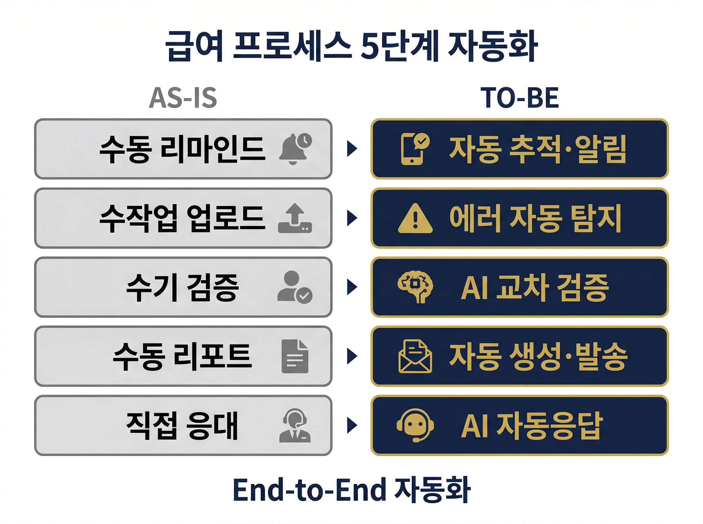
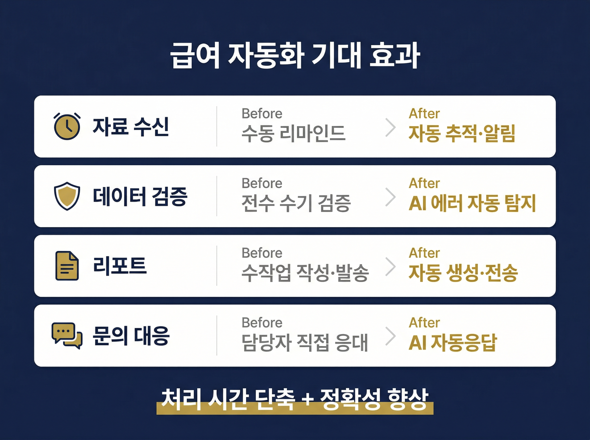
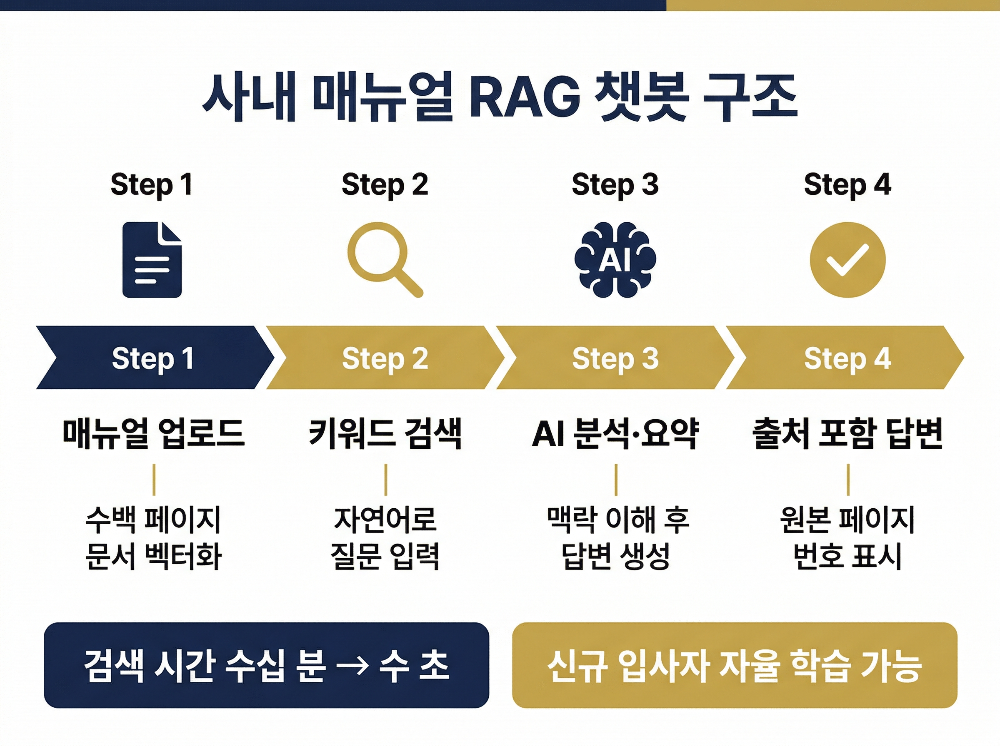
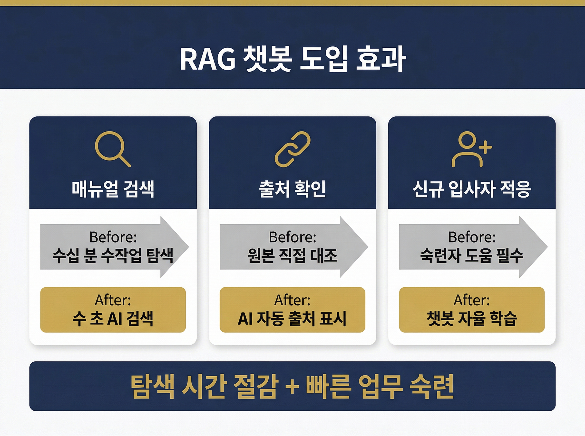

# HR 부서의 AX는 어디서부터 시작할까 — 급여 자동화와 사내 지식 챗봇, 두 가지 실전 사례

HR 부서에서 AI를 도입하겠다고 하면, 가장 먼저 나오는 반응은 비슷합니다. "채용 자동화? 아직 이르지 않나." 하지만 현장에서 실제로 먼저 움직이는 영역은 채용이 아닙니다. 급여 처리처럼 반복되는 운영 업무, 그리고 신입 사원이 매뉴얼을 찾느라 허비하는 시간. 이 두 가지가 HR AX의 현실적인 출발점입니다.

매직에꼴 AX 훈련 프로그램에 참여한 두 기업의 사례를 통해, HR 부서가 지금 바로 시작할 수 있는 AX의 모습을 살펴보겠습니다.

---

## HR 운영의 가장 큰 병목은 '반복'입니다

HR 부서는 조직 내에서 가장 많은 반복 업무를 처리하는 부서 중 하나입니다. 급여 산출, 4대보험 처리, 근태 정산, 각종 증명서 발급. 매월, 매주 돌아오는 이 업무들은 정확성이 생명이지만, 대부분 수작업에 의존합니다.

동시에 HR은 조직의 지식 허브이기도 합니다. 업무 매뉴얼, 사내 규정, 교육 자료. 이 정보들이 체계적으로 검색되지 않으면, 신입 사원뿐 아니라 경력 직원도 같은 질문을 반복하게 됩니다.

이 두 가지 문제는 성격이 다르지만, 해결 방향은 같습니다. AI가 반복을 맡고, 사람은 판단에 집중하는 구조입니다.

---

## 사례 1: 급여 프로세스 5단계 자동화

한 HR 서비스 기업의 급여관리팀은 매월 같은 문제와 싸우고 있었습니다.

**기존 문제:**
- 고객사 급여 자료가 지연되면 담당자가 일일이 수동으로 리마인드
- 파일 업로드, 안내, 커뮤니케이션 전부 수작업
- 급여 산출 결과를 전수 수기 검증하면서 업무 부담 가중

하나의 고객사 급여를 처리하는 데도 여러 단계의 수작업이 필요했고, 고객사가 늘어날수록 같은 작업이 배수로 반복됐습니다.

**AI 적용 방식 — 5단계 풀 자동화:**

1. **자료수신 자동처리** — 고객사 자료 제출 현황을 자동 추적하고, 미제출 시 자동 리마인드
2. **파일 업로드 및 에러 검증 자동화** — 업로드된 데이터의 형식 오류와 누락을 AI가 즉시 탐지
3. **급여 계산 및 정확성 검증 자동화** — 산출 결과를 규칙 기반으로 자동 교차 검증
4. **리포트 자동 생성 및 전송** — 고객사별 급여 리포트를 자동 생성하여 발송
5. **고객사 문의 자동응답** — 반복되는 급여 관련 질문에 AI가 즉시 대응

> **핵심**: 단일 단계가 아니라 수신부터 응답까지 전 과정을 연결한 엔드투엔드 자동화가 핵심이었습니다.

**업무 처리 시간 단축과 급여 정확성 동시 확보**, 그리고 **반복 수작업 제거를 통한 HR 운영 효율성 향상**이 기대 효과로 확인됐습니다.

---

## 사례 2: 사내 매뉴얼 검색 RAG 챗봇

한 대기업 제조사의 기술지원팀은 다른 종류의 반복에 시달리고 있었습니다.

**기존 문제:**
- 제조사별로 수백 페이지의 매뉴얼이 존재하지만, 필요한 정보를 찾는 데 과도한 시간 소요
- 다양한 종류의 매뉴얼을 구분하고 관리하기 어려움
- 검색 결과의 출처 확인이 불가능해 신뢰성 부족

이 문제는 기술지원팀만의 문제가 아닙니다. HR 부서의 온보딩, 사내 규정 안내, 교육 자료 검색에도 동일한 구조의 비효율이 존재합니다.

**AI 적용 방식 — RAG 기반 지식 검색 챗봇:**

- RAG(검색 증강 생성) 기술로 사내 매뉴얼 전체를 벡터화하여 검색 가능하게 구축
- 키워드 입력 시 관련 매뉴얼 내용을 AI가 정리하여 답변 제공
- 모든 답변에 **원본 출처를 명시**하여 검증 가능성 확보
- 무분별한 데이터 업로드를 방지하는 관리자 기능 포함

> **핵심**: 단순 검색이 아니라, AI가 맥락을 이해하고 원본 출처와 함께 정리된 답변을 제공하는 구조입니다.

**자료 탐색 시간 절감을 통한 신속한 업무 대응**과, **신규 입사자의 단기간 내 업무 숙련 가능성**이 기대 효과로 확인됐습니다.

---

## 두 사례가 HR 부서에 주는 공통 시사점

두 사례는 업종도 규모도 다르지만, HR 관점에서 공통된 교훈을 남깁니다.

**첫째, HR AX의 출발점은 거창한 프로젝트가 아닙니다.** 급여 처리의 수작업을 줄이거나, 매뉴얼 검색을 빠르게 만드는 것. 이미 반복되고 있는 업무에서 시작하는 것이 가장 현실적입니다.

**둘째, 자동화의 핵심은 단일 기능이 아니라 연결입니다.** 급여 사례에서 보듯, 자료 수신부터 문의 응답까지 전 과정이 연결되어야 진짜 효율이 나옵니다. 한 단계만 자동화하면 병목이 다음 단계로 옮겨갈 뿐입니다.

**셋째, 사람의 역할은 사라지지 않고 이동합니다.** 급여 담당자는 데이터 입력 대신 예외 처리와 전략적 판단에 집중하게 됩니다. 기술지원 담당자는 매뉴얼 검색 대신 고객 상황에 맞는 해결책 설계에 시간을 쓸 수 있습니다.

---

## HR AX, 지금 시작할 수 있습니다

많은 HR 리더가 AI 도입을 "내년 과제"로 미루고 있습니다. 하지만 위 사례들이 보여주듯, HR AX는 대규모 시스템 교체가 아니라 현재 업무의 반복 구간을 찾아 자동화하는 것부터 시작할 수 있습니다.

우리 HR 부서에서 가장 많은 시간을 잡아먹는 반복 업무는 무엇인가요? 그 질문에 답할 수 있다면, AX의 출발선은 이미 보이고 있는 셈입니다.

---

> **우리 HR 부서의 AX, 어디서부터 시작할까요?**
> [매직에꼴 AX 컨설팅 알아보기 ->](https://ax-inquiry-system.vercel.app/inquiry)
