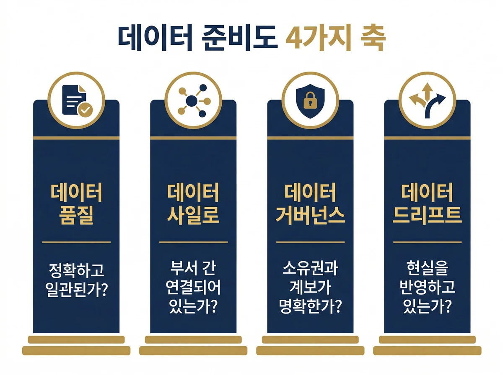
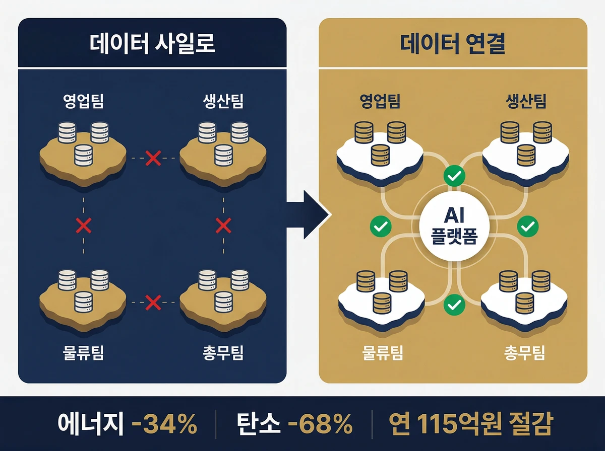

# "우리 데이터, AI에 쓸 수 있나요?" — 기업 데이터 준비도 자가 진단 가이드

회의실에서 CTO가 물었습니다. "우리 데이터는 어디 있죠?"

총무팀은 엑셀에 있다고 했습니다. 영업팀은 CRM 시스템이라고 했습니다. 생산팀은 설비 로그 서버라고 했습니다. 그리고 누구도 그것들을 한 번도 합쳐본 적이 없었습니다.

AI 도입 프로젝트를 준비하면서 가장 먼저 부딪히는 벽이 여기 있습니다. 모델 선택보다, 인력 확보보다, 예산보다 먼저 해결해야 할 것이 있습니다. 바로, 데이터 준비도(data readiness)가 충분한가 하는 문제입니다.

## AI 프로젝트 95%가 실패하는 원인 — 데이터 준비도의 민낯

MIT의 2025년 연구는 충격적인 숫자를 내놓았습니다. 기업의 생성형 AI 파일럿 프로젝트 중 95%가 측정 가능한 비즈니스 임팩트를 만들지 못했습니다. 300개 이상의 공개 AI 배포 사례와 150명의 임원 인터뷰를 분석한 결과입니다.

더 충격적인 것은 실패 원인이 모델 기술이 아니라는 사실입니다. MIT 연구는 임팩트 미달의 근본 원인을 이렇게 짚었습니다. 워크플로우 통합 부재, 조직 정렬 실패, 그리고 데이터 준비도 부족.

가트너는 한 발 더 나아갑니다. 2026년까지 'AI에 적합한 데이터'가 뒷받침되지 않는 AI 프로젝트의 60%가 중단될 것이라고 전망했습니다. 그런데 Cloudera와 HBR의 2026년 공동 조사를 보면, 자사 데이터가 AI에 **완전히** 준비되었다고 응답한 기업은 단 7%에 불과했습니다. 73%는 AI에 쓸 수 있는 데이터를 갖추는 데 어려움을 겪고 있다고 답했죠.

AI 프로젝트를 세 발 달린 의자로 비유한다면, 모델·프로세스·데이터라는 세 다리가 필요합니다. Congruity360의 분석은 대부분의 기업이 모델 다리에만 집중하다가 데이터 다리가 흔들려 쓰러진다고 설명합니다.

---

## 데이터 준비도를 가르는 4가지 축

그렇다면 데이터가 준비된 상태란 정확히 무엇일까요? 막연하게 "데이터가 많다", "정리가 잘 되어 있다"는 인상만으로는 판단할 수 없습니다.

데이터 준비도는 크게 4가지 축으로 점검할 수 있습니다.

<table style="width:100%;border-collapse:collapse;font-size:15px;line-height:1.7;"><thead><tr style="background:#e2e8f0;"><th style="padding:14px 18px;text-align:left;font-weight:800;font-size:15px;color:#0f172a;border-right:1px solid #cbd5e1;border-bottom:2px solid #94a3b8;">점검 축</th><th style="padding:14px 18px;text-align:left;font-weight:800;font-size:15px;color:#0f172a;border-right:1px solid #cbd5e1;border-bottom:2px solid #94a3b8;">핵심 질문</th><th style="padding:14px 18px;text-align:left;font-weight:800;font-size:15px;color:#0f172a;border-bottom:2px solid #94a3b8;">어떤 일이 생기나</th></tr></thead><tbody><tr style="background:#f8fafc;"><td style="padding:12px 18px;border-bottom:1px solid #cbd5e1;border-right:1px solid #cbd5e1;font-weight:700;color:#0f172a;">품질</td><td style="padding:12px 18px;border-bottom:1px solid #cbd5e1;border-right:1px solid #cbd5e1;color:#334155;">정확하고 일관된 데이터인가</td><td style="padding:12px 18px;border-bottom:1px solid #cbd5e1;color:#334155;">모델이 엉뚱한 답을 내기 시작한다</td></tr><tr style="background:#ffffff;"><td style="padding:12px 18px;border-bottom:1px solid #cbd5e1;border-right:1px solid #cbd5e1;font-weight:700;color:#0f172a;">사일로</td><td style="padding:12px 18px;border-bottom:1px solid #cbd5e1;border-right:1px solid #cbd5e1;color:#334155;">부서 간 데이터가 연결되어 있는가</td><td style="padding:12px 18px;border-bottom:1px solid #cbd5e1;color:#334155;">전체 그림 없이 부분만 학습한다</td></tr><tr style="background:#f8fafc;"><td style="padding:12px 18px;border-bottom:1px solid #cbd5e1;border-right:1px solid #cbd5e1;font-weight:700;color:#0f172a;">거버넌스</td><td style="padding:12px 18px;border-bottom:1px solid #cbd5e1;border-right:1px solid #cbd5e1;color:#334155;">데이터 소유권과 계보가 명확한가</td><td style="padding:12px 18px;border-bottom:1px solid #cbd5e1;color:#334155;">감사 불가, 리스크가 조용히 쌓인다</td></tr><tr style="background:#ffffff;"><td style="padding:12px 18px;border-right:1px solid #cbd5e1;font-weight:700;color:#0f172a;">드리프트</td><td style="padding:12px 18px;border-right:1px solid #cbd5e1;color:#334155;">데이터가 현실을 여전히 반영하는가</td><td style="padding:12px 18px;color:#334155;">성능이 바래 사라지고 ROI가 소멸한다</td></tr></tbody></table>

핵심

데이터 준비도는 "있느냐"가 아니라 "쓸 수 있느냐"의 문제입니다.

각 축을 하나씩 짚어보겠습니다.

### 1축 — 데이터 품질: AI가 좋은 답을 내려면 좋은 재료가 있어야 한다

데이터 품질은 가장 기본적이지만 가장 자주 간과됩니다. 비유하자면, 요리사에게 상한 재료를 주면서 미슐랭 요리를 기대하는 것과 같습니다.

Congruity360의 분석에 따르면 기업이 겪는 대표적인 문제는 세 가지입니다. 잘못된 값이나 누락된 필드를 가진 데이터로 모델을 훈련시키면, 모델은 실수를 학습합니다. 라벨링이 일관되지 않으면 맥락을 잃고요. 방대한 데이터도 신호보다 노이즈가 많으면 오히려 성능을 갉아먹습니다.

데이터 카탈로그 기업 Secoda는 2024년 기준으로 기업 데이터의 68%가 분석과 혁신 목적에서 여전히 활용되지 못하고 있다고 보고했습니다. 데이터가 있어도 쓸 수 있는 상태가 아닌 경우가 대부분이라는 뜻입니다.

실무 점검 질문입니다. 우리 팀이 AI에 넣으려는 데이터에서 결측치와 오류가 얼마나 됩니까? 라벨이나 분류 체계가 부서별로 제각각이지는 않습니까?

RAG(검색 증강 생성) 기반 솔루션을 구축할 때도 데이터 품질은 가장 먼저 해결해야 할 과제입니다. [RAG 기반 지식 관리 구축 방법](/blog/rag-basic-advanced-graphrag-guide)에서 데이터 정비가 RAG 성능에 미치는 영향을 더 자세히 살펴볼 수 있습니다.

### 2축 — 데이터 사일로: 부서 간 데이터 단절이 AI를 망친다

산업 현장에서 매일 수십억 개의 데이터 포인트가 쏟아지는데도 AI가 제대로 작동하지 않는 역설이 있습니다. 데이터 사일로 때문입니다.

데이터 사일로(data silo)란, 각 부서나 시스템이 자기 데이터를 독자적으로 관리하면서 서로 공유하지 않는 상황입니다. 영업팀 섬, 생산팀 섬, 물류팀 섬 — AI는 이 섬들을 연결하지 않으면 전체 그림을 볼 수 없습니다. 각 팀의 데이터로는 맞는 것처럼 보이는 답이, 회사 전체로 보면 틀린 결론이 되는 셈이죠.

Congruity360의 분석에서도 사일로는 핵심 실패 원인으로 꼽혔습니다. 데이터가 부서 시스템이나 레거시 아카이브에 갇혀 있으면 모델은 부분적 시야에서만 학습합니다. 교차 기능적 인사이트가 빠진 채로요.

반면 글로벌 소비재 기업 헨켈(Henkel)은 기계 데이터를 AI 플랫폼으로 통합한 '디지털 백본'을 구축해 에너지 소비를 34%, 탄소 배출을 68% 감축하는 성과를 냈습니다. 연간 약 800만 유로(한화 약 115억 원)의 재무적 이익으로 직결됐습니다. 데이터를 연결한 것이 전부였는데 말이죠.

사일로 해소가 데이터를 하나의 거대한 웨어하우스로 끌어모으는 작업은 아닙니다. 각 시스템이 필요할 때 서로 연결될 수 있도록 구조를 설계하는 것입니다.

종이나 PDF 형태로 잠든 문서가 많다면, 매직에꼴의 PBT VLM OCR Suite처럼 비정형 문서를 검색 가능한 디지털 자산으로 변환하는 것이 사일로 해소의 첫 걸음이 되기도 합니다.

### 3축 — 데이터 거버넌스: 나중에 잡으면 두 배 비용이 든다

데이터 거버넌스(data governance)는 속도를 늦추는 관료주의처럼 보입니다. 실제로는 그 반대에 가깝습니다. 왜 그럴까요?

거버넌스가 제대로 잡혀 있다는 것은 이런 상태입니다. 데이터마다 소유자가 명확합니다. 이 데이터가 어디서 왔고 어떻게 변형되었는지 추적할 수 있죠. 어떤 팀이 어떤 데이터에 접근할 수 있는지 정책이 있습니다. AI가 학습에 활용한 데이터가 규정과 윤리 기준에 부합한다는 것을 입증할 수 있고요.

CIO.com의 분석은 거버넌스를 '레드 테이프'가 아니라 '워크플로우 가속 엔진'으로 재정의합니다. 소유권이 분명하고 프로세스가 감사 가능한 상태라면, 긴급 데이터 수정이 불러오는 혼란을 막고 승인 절차를 오히려 빠르게 할 수 있습니다. 거버넌스가 없는 조직은 AI를 도입한 뒤에야 그 공백을 메우느라 처음의 두 배를 씁니다.

거버넌스 없는 AI 확산이 왜 위험한지, [AI 거버넌스 없는 기업이 맞닥뜨리는 실제 문제](/blog/기업-ax에서-가장-주의해야-할-점-거버넌스-없는-ai-확산을-막는-법)에서 더 구체적인 사례를 확인할 수 있습니다.

실무 점검입니다. 지금 우리 조직에서 "이 데이터 어디서 왔어?"라고 물었을 때 30분 안에 답이 나옵니까? 나오지 않는다면 거버넌스가 없는 것입니다.

### 4축 — 데이터 드리프트: AI가 조용히 현실을 놓치는 순간

와인은 오래될수록 깊어지죠. 데이터는 다릅니다.

고객 취향은 변하고, 공급망은 재편됩니다. 규제는 강화되고 시장 구조가 바뀝니다. 이 변화로 인해 AI가 과거에 학습한 '세상의 모습'과 현실이 어긋나는 현상 — 이것을 드리프트(drift)라고 부릅니다. AI가 조용히 현실을 놓치는 순간입니다.

CIO.com은 드리프트를 두 종류로 구분합니다. 데이터 드리프트는 입력 데이터 분포가 달라지는 경우입니다. 주요 고객층의 연령대나 지역이 바뀌는 상황이 이에 해당합니다. 개념 드리프트는 입력과 결과 사이의 관계 자체가 변하는 경우입니다. 팬데믹 이전에 설계된 알고리즘이 이후 환경에서 더는 맞지 않는 것이 대표적 사례입니다.

드리프트를 방치하면 어떻게 될까요? 이커머스 기업 사례에서 CTR이 예고 없이 30% 하락했는데 아무도 알아채지 못한 적이 있었습니다. 부동산 플랫폼 Zillow는 주택 가치 평가 알고리즘이 드리프트를 일으켜 2021년 3~4분기에 5억 달러 이상 과대평가하는 결과를 낳았다는 분석이 나왔습니다.

AI는 어느 날 갑자기 실패하지 않습니다. 정확도가 조금씩 바래 사라질 뿐입니다. 눈치챌 때는 이미 비즈니스 손실이 쌓인 후입니다.

---

## 데이터 정비가 AX를 가속한다

여기까지 읽고 "그래서 데이터 정비하려면 얼마나 걸립니까?"라고 묻고 싶은 분이 많을 겁니다.

현실적으로 시간이 걸립니다. 하지만 그것이 투자하지 않을 이유는 되지 않습니다.

월마트는 공급망, POS, 솔루션 업체 데이터를 수년에 걸쳐 연결했습니다. 탄탄한 기반이 갖춰지자, AI 도입이 훨씬 빠르게 굴러갔습니다. 비용 절감, 품절 감소, 배송 효율화로 이어졌습니다. 데이터 기반을 먼저 닦았기 때문에 AI가 실제로 작동한 것이죠.

딜로이트와 EY의 각 조사 결과도 이를 뒷받침합니다. 스마트 팩토리와 데이터 생태계를 도입한 기업들이 그렇지 않은 기업보다 생산성과 매출 성장에서 평균 15~20%의 우위를 점하고 있다고 분석했습니다.

데이터 정비를 'AI 도입 이전에 끝내야 할 일회성 과제'로 보지 않아야 합니다. AI가 실제로 작동하도록 만드는 지속적인 역량입니다. 그리고 그 역량을 구축한 조직만이 AX를 스케일업할 수 있습니다.

자, 그렇다면 지금 우리 조직은 어디쯤 서 있을까요?

---

## 데이터 준비도 자가 점검: 오늘 바로 시작하는 3가지 방법

데이터 준비도 점검을 어디서부터 시작해야 할지 모르겠다면, 다음 세 가지를 오늘 당장 해볼 수 있습니다.

실행 포인트 1

AI에 가장 먼저 적용하려는 업무 영역을 하나 정하고, 그 영역에서 사용하는 데이터 소스 목록을 작성하세요. 몇 개 부서에 흩어져 있습니까? 포맷이 통일되어 있습니까?

실행 포인트 2

그 데이터들의 소유자를 확인하세요. "이 데이터는 누가 관리하고 있습니까?"라는 질문에 30분 안에 답이 나오지 않는다면 거버넌스 공백이 있는 겁니다.

실행 포인트 3

그 데이터가 마지막으로 업데이트된 시점을 확인하세요. 1년 이상 업데이트되지 않은 데이터가 있다면 드리프트 리스크를 안고 AI를 도입하려는 것입니다.

이 세 가지 점검만 해도 우리 조직의 데이터 준비도가 어느 수준인지 윤곽이 잡힙니다. 더 구체적인 진단이 필요하다면, 매직에꼴의 AX 진단을 통해 데이터·전략·조직·프로세스 전 영역을 체계적으로 점검해볼 수 있습니다.

MIT 연구가 짚은 핵심은 분명합니다. 실패의 원인은 모델이 아니었습니다. 워크플로우 통합 부재, 조직 정렬 실패, 그리고 데이터 준비도 부족입니다. 데이터를 먼저 점검한 조직만이 AI에서 실질적인 결과를 만들어냅니다.

우리 회사 데이터, 정말 쓸 수 있는 상태입니까?

매직에꼴 AX 컨설팅은 데이터·전략·조직·프로세스 전 영역을 체계적으로 진단합니다.

<a href="https://ax-inquiry-system.vercel.app/inquiry" style="display:inline-block;padding:12px 22px;border-radius:999px;background:#ffffff;color:#0f172a;text-decoration:none;font-size:15px;font-weight:800;">AX 컨설팅 알아보기</a>

---

**참고 자료**

- [The GenAI Divide: State of AI in Business 2025 — MIT](https://www.technologyreview.com/2025/)
- ["실패하는 것은 AI가 아니라 데이터" 데이터 준비도가 성패 가른다 — CIO.com](https://www.cio.com/article/4137711/)
- [Lack of AI-Ready Data Puts AI Projects at Risk — Gartner](https://www.gartner.com/en/newsroom/press-releases/2025-02-26-lack-of-ai-ready-data-puts-ai-projects-at-risk)
- [Only 7% of Enterprises Say Their Data Is Completely Ready for AI — Cloudera/HBR](https://www.cloudera.com/about/news-and-blogs/press-releases/2026-03-05-only-7-percent-of-enterprises-say-their-data-is-completely-ready-for-ai)
