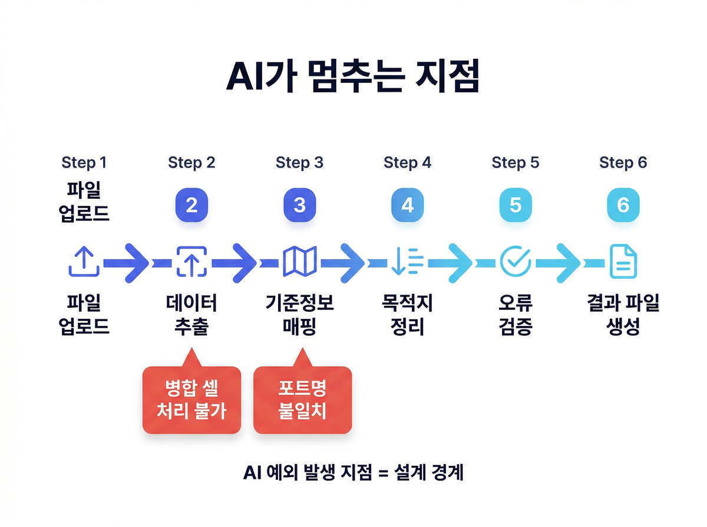
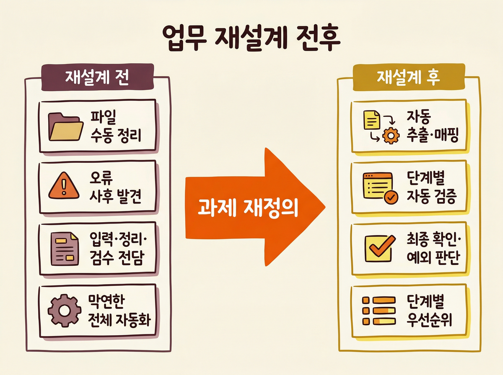

# 물류 AX 사례: 과제 범위를 바꾸자 자동화가 가능해졌다

물류팀이 해상 운임 자동화를 시도했다가 막혔고, 과제를 다시 정의하고 나서 방향을 바꾼 사례다.

매일 아침 선사와 포워더가 보낸 파일이 쌓였다. 양식은 제각각이고 포트명 표기도 조금씩 달랐다. 누락은 없는지, 중복은 없는지 한 줄씩 확인하는 일을 매일 반복했다.

---

## 운임 시장이 매일 바뀌는데, 업무 방식은 그대로였다

한때 해상 운임은 주간 단위로만 챙겨도 됐다. 그 주기가 격주, 이후 사실상 매일로 짧아졌다. 그런데 데이터를 받아서 정리하는 방식은 그 전과 크게 다르지 않았다.

선사와 포워더가 보내는 파일에는 표준 양식이 없다. 회사마다, 담당자마다 구성이 달랐고 그 일을 처리하는 건 결국 사람 몫이었다. 속도가 빨라질수록 누락이나 오기입이 날 가능성도 같이 커지는 구조였다.

---

## 물류 자동화 사례가 막히는 첫 번째 이유

훈련을 시작하면서 팀이 처음 꺼낸 과제는 "운임 업무 전체를 자동화하자"였다. 현업을 잘 아는 사람에게는 자연스러운 출발점이었지만, 막상 뭘 먼저 해야 할지는 잘 보이지 않았고 3일 안에 검증해볼 수 있는 범위가 어딘지도 잡히지 않았다.

---

## AI가 멈춘 자리마다 이유가 있었다

과제를 좁히면서 팀은 업무 흐름을 단계별로 나눠봤다. 파일 업로드, 데이터 추출, 기준정보 매핑, 목적지·경유지 정리, 오류 검증, 결과 파일 생성으로 여섯 단계였다.

단계를 나열하고 나서야 문제가 보이기 시작했다. 엑셀 파일에는 병합된 셀이 곳곳에 있었고, 한 셀 안에 여러 정보가 뭉쳐 있는 경우도 많았다. AI는 그 구조 앞에서 멈췄다. 포트명도 마찬가지였는데, 기준정보에는 한 가지 이름으로 등록돼 있지만 외부 파일에서는 대소문자가 다르거나 약어가 섞여 있었다. 사람이라면 맥락으로 넘어가던 것들이 AI 쪽에서는 전부 예외 처리 대상이 됐다.

"디테일로 들어갈수록 최종 검증은 사람이 필요했다." 훈련 과정에서 팀 구성원이 직접 한 말이다.

---

## AX 문제 재설계: 질문 자체를 바꿨다

시행착오가 반복되면서 팀 안에서 다른 질문이 나왔다. "전체를 자동화하는 게 목표인가, 아니면 사람이 가장 자주 반복하는 단계를 줄이는 게 목표인가."

그러면서 '전체 자동화'보다 '사람이 가장 자주 반복하는 단계부터 잘라내자'는 방향으로 바뀌었다. 여섯 단계 가운데 AI가 안정적으로 처리할 수 있는 구간을 찾아내고, 사람이 맡아야 할 구간과 경계를 그었다. 입력·정리·검수 전체를 담당하던 역할이 최종 확인과 예외 판단 중심으로 바뀌었다.

팀은 회고에서 "정확한 요청 사항과 사전 과제 정의가 중요했다"고 했다.

---

## 업무 재설계 전후, 무엇이 달라졌나

예전에는 파일을 받아도 어디서 문제가 생길지 입력이 다 끝나기 전까지 알 수 없었다. 오류를 발견하면 처음부터 다시 해야 하는 경우가 많았다.

흐름을 단계별로 나눈 뒤에는 어디서 멈출 수 있는지가 미리 보이기 시작했다. 예외가 생겨도 전체를 되돌리지 않고 그 지점만 다시 처리하면 됐다. 일이 줄어든 게 아니라 어디를 봐야 하는지가 달라진 거였다.

---

## 훈련이 끝나고 남은 것

처음 목표는 전체 자동화였다. 실제로 만들어진 건 업무 흐름 6단계 중 어디를 AI가 처리할 수 있고 어디에 사람이 있어야 하는지를 나눠놓은 구분이었다.

AI가 멈춘 자리는 병합 셀, 포트명 불일치, 뭉쳐 있는 셀처럼 그동안 담당자가 별 의식 없이 처리하던 것들이었다. 자동화를 붙여보기 전까지는 거기서 판단이 개입한다는 걸 딱히 생각해본 적이 없었다.

팀원들이 일이 줄어든 건 아니었다. 반복 입력하던 자리에서 예외를 확인하는 자리로 옮겨갔다.

> **우리 팀의 반복 업무, 어디서 경계를 그어야 할지 아직 보이지 않는다면?**
> 매직에꼴 AX 컨설팅이 함께 들여다봅니다.
> [매직에꼴 AX 컨설팅 알아보기 →](https://ax-inquiry-system.vercel.app/inquiry)

