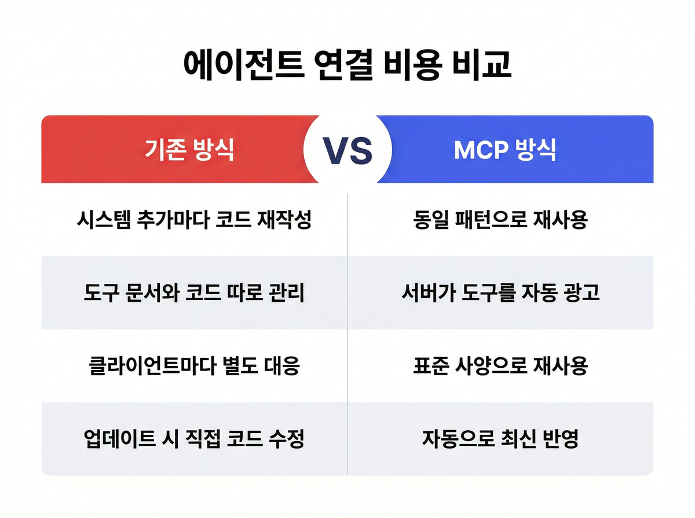
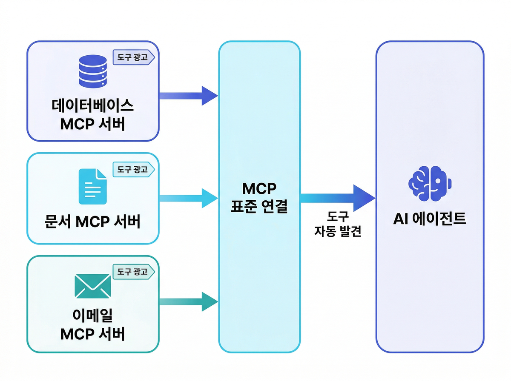

# AI 에이전트 붙일 때마다 코드가 쌓인다면, MCP부터 보세요

AI 에이전트를 하나 붙였더니 잘 돼서 시스템 두 개를 더 연결했습니다. 그런데 어느 순간 연결 코드가 쌓이고, 도구 정의가 따로 놀고, 새 시스템 하나 추가할 때마다 며칠이 걸립니다. 에이전트는 점점 나아지는데 주변 작업은 오히려 늘어나는 느낌이 납니다.

## AI가 막히는 곳은 모델이 아닙니다

AI 에이전트를 도입할 때 대부분 모델 성능과 프롬프트부터 봅니다. Anthropic이 MCP(Model Context Protocol, 모델 컨텍스트 프로토콜)를 처음 소개하면서 짚은 문제는 다른 데 있었습니다. 모델이 아무리 좋아도 데이터와 도구에 연결되지 않으면 실무에서는 금방 막힌다는 것이었습니다.

새 데이터 소스가 생길 때마다 그에 맞는 커스텀 구현을 따로 만들어야 했습니다. 시스템이 늘수록 에이전트가 더 잘 동작하는 게 아니라, 연결 코드가 먼저 복잡해졌습니다.

---

## 현장에서 이런 장면이 생깁니다

Google이 든 식당 공급망 에이전트 사례가 있습니다. 재고 데이터베이스를 읽고, 노션 문서를 참고하고, 이메일로 공급사에 연락하는 에이전트입니다. MCP 없이 만들면 PostgreSQL, Notion, Mailgun 각각에 맞는 통합 코드를 따로 작성해야 합니다. 서비스가 하나 추가되면 코드도 하나 더 붙고, 도구 정의가 업데이트되면 연결 코드를 같이 손봐야 합니다.

연결 대상이 셋 정도면 그나마 관리가 됩니다. 사내 ERP, HR 시스템, 고객 데이터, 슬랙, 문서 저장소가 동시에 얽히기 시작하면 코드베이스 자체가 먼저 무너집니다.

---

## 우리가 계속 반복해온 비용, MCP가 끊는 방식

새 시스템이 생기면 그에 맞는 연결 코드를 처음부터 다시 씁니다. 도구 정의는 코드 밖에서 따로 관리되다 보니 시간이 지나면 문서와 실제 구현이 따로 놀게 됩니다. 서비스 API가 바뀌면 연결된 코드를 일일이 찾아야 하고요.

MCP를 쓰면 새 시스템을 붙일 때 같은 연결 방식을 재사용할 수 있고, 서버가 자신이 제공하는 도구를 직접 알리기 때문에 문서와 코드가 따로 관리될 이유가 없어집니다. 도구 정의가 바뀌어도 에이전트 코드는 그대로 두면 됩니다.

---

## MCP가 이 문제를 푸는 방식

MCP는 AI 어시스턴트와 데이터 저장소, 비즈니스 툴, 개발 환경 사이를 잇는 개방형 표준입니다. 노트북마다 충전 단자가 달라서 어댑터를 따로 챙겨야 했다가, USB-C 하나로 웬만한 기기를 다 쓸 수 있게 된 것과 결이 비슷합니다.

서버가 도구를 스스로 광고하고, 에이전트가 필요한 도구를 표준 방식으로 찾아 씁니다. Google의 식당 에이전트 예시로 돌아가면, MCP 서버가 PostgreSQL·Notion·Mailgun 도구를 각각 알리면 에이전트가 그걸 찾아서 씁니다. 시스템마다 별도 코드를 유지할 필요가 없어집니다.

에이전트가 읽어야 할 데이터 소스를 AI가 쓸 수 있는 상태로 준비하는 게 먼저라면, 데이터 준비도 점검 방법도 함께 보세요.

---

## 서버가 도구를 광고하고, 에이전트가 찾아 쓴다 — 구조는 이게 전부입니다

MCP는 서버와 클라이언트로 나뉩니다. MCP 서버는 데이터 소스나 도구 쪽에서 "나는 이런 기능을 제공한다"고 알리고, MCP 클라이언트는 에이전트 쪽에서 그 서버에 붙어 도구를 가져다 씁니다.

OpenAI는 이 프로토콜을 서버·모델·UI를 하나로 맞물리게 하는 기반으로 보고 있습니다. 도구 호출부터 사용자 입력 요청까지 하나의 흐름에서 처리할 수 있어서 구현이 단순해집니다. AWS는 여기에 비동기 처리(Tasks)와 사용자 추가 입력(Elicitations) 기능을 얹었는데, 긴 작업을 중간에 끊지 않고 처리하거나 실무 흐름 안에서 사람 확인을 받을 때 씁니다.

에이전트에 문서 검색 기능까지 붙이고 싶다면 RAG 조합도 살펴볼 수 있습니다. [RAG 기반 지식 연결 방법](/blog/rag-basic-advanced-graphrag-guide)에서 구체적인 방향을 확인해보세요.

---

## 언제부터 MCP를 봐야 할까요

툴이 몇 개 없고 단일 챗봇이 중심이라면 지금 당장 MCP가 필수는 아닙니다. 다만 아래 상황 중 하나라도 해당된다면 슬슬 검토할 시점이 온 겁니다.

- 여러 사내 시스템과 SaaS를 에이전트가 오가야 한다
- 도구 연결 코드를 지금도 계속 새로 만들고 있다
- 앞으로 멀티에이전트 구조를 염두에 두고 있다
- 권한 관리와 작업 감사가 요구되는 환경이다

현재 공개된 MCP 서버는 10,000개를 넘었고, ChatGPT·Gemini·Microsoft Copilot·VS Code·Cursor가 채택했습니다. AWS·Google Cloud·Microsoft Azure가 엔터프라이즈 지원을 추가했고, Python·TypeScript SDK의 월 다운로드는 9,700만 회를 넘었습니다. Anthropic이 Linux Foundation 산하 Agentic AI Foundation에 MCP를 기부하면서, 특정 회사 소유가 아닌 중립적인 표준으로 관리되기 시작했습니다.

Microsoft는 표준 혼자로는 부족하고 아이덴티티·신뢰·관측성·거버넌스가 같이 있어야 엔터프라이즈에서 쓸 수 있다고 봅니다. MCP는 모델을 업그레이드하거나 에이전트 로직을 고치는 기술이 아니라, 여러 도구와 시스템을 덜 제각각으로 붙이고 운영 가능한 수준으로 관리하기 위한 연결 방식입니다.

> **우리 조직의 에이전트, 지금 어디에서 막히고 있나요?**
> 연결 구조와 운영 기준까지 함께 점검해야 한다면, 매직에꼴 AX 컨설팅에서 진단해보실 수 있습니다.
> [매직에꼴 AX 컨설팅 알아보기 →](https://ax-inquiry-system.vercel.app/inquiry)

**참고 자료**
- [Introducing the Model Context Protocol](https://www.anthropic.com/news/model-context-protocol)
- [Donating the Model Context Protocol and establishing the Agentic AI Foundation](https://www.anthropic.com/news/donating-the-model-context-protocol-and-establishing-of-the-agentic-ai-foundation)
- [MCP – Apps SDK | OpenAI Developers](https://developers.openai.com/apps-sdk/concepts/mcp-server/)
- [Agent Factory: Designing the open agentic web stack | Microsoft Azure Blog](https://azure.microsoft.com/en-us/blog/agent-factory-designing-the-open-agentic-web-stack/)
- [Shaping the future of MCP: AWS's commitment and vision | Amazon Web Services](https://aws.amazon.com/blogs/opensource/shaping-the-future-of-mcp-aws-commitment-and-vision/)
- [Developer's Guide to AI Agent Protocols | Google for Developers](https://developers.googleblog.com/developers-guide-to-ai-agent-protocols/)
