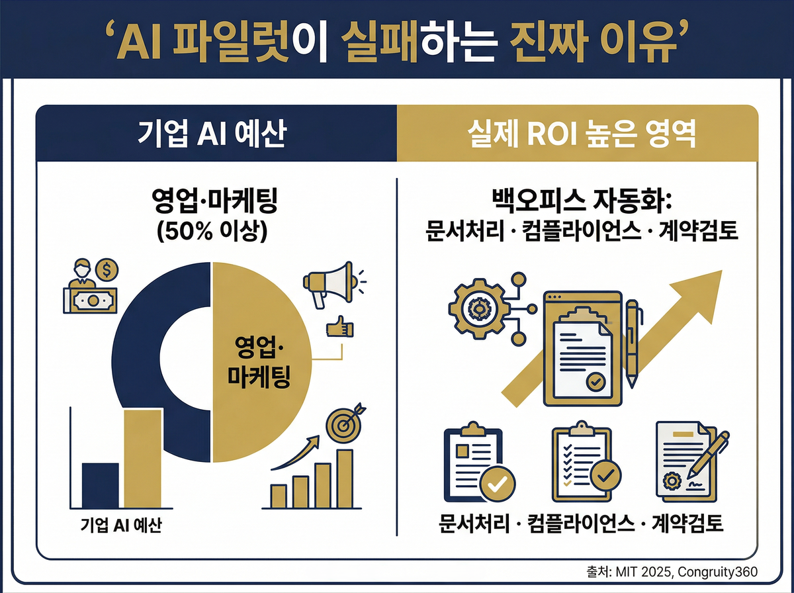
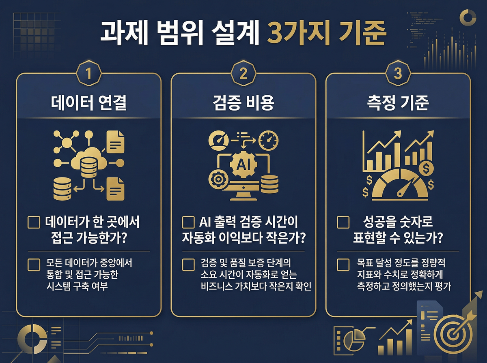

# AI 에이전트를 연결하기 전에, 어디에 연결할지 정했나요?

어느 팀이 생성형 AI 파일럿을 6개월째 돌리고 있었습니다.

모델도 골랐고, API도 연결했고, 담당자도 붙였습니다. 그런데 회의마다 "아직 성과가 없다"는 말이 나왔습니다. 결국 그 팀은 파일럿을 접었고, 다음 분기 예산 회의에서 "AI는 우리 회사엔 안 맞다"는 결론이 나왔습니다.

이 팀만의 이야기가 아닙니다.

## 이 상황, 낯설지 않으시죠?

MIT 2025 보고서에 따르면 생성형 AI 파일럿의 약 95%가 측정 가능한 비즈니스 임팩트를 달성하지 못합니다.

이상하지 않으신가요? 모델 성능은 분명히 좋아졌고, 도구도 많아졌는데 왜 현장에서는 결과가 안 나올까요?

실패한 팀들을 살펴보면 공통된 장면이 보입니다. 가장 먼저 "어떤 모델을 쓸지", "어떤 도구를 붙일지"를 논의합니다. 그런데 정작 "무엇을 해결할 것인지"는 나중에, 혹은 아예 논의하지 않습니다.

더 정확히 말하면, 과제 범위를 구체적으로 설계하지 않은 채 기술을 먼저 도입합니다. 기술이 범위를 만들어줄 것이라고 기대하면서요.

## 우리가 놓치고 있던 진짜 문제: 기술이 아니라 설계

Congruity360이 분석한 95% 실패 사례를 들여다보면, 반복되는 장면이 있습니다.

실패 원인 1위는 모델 품질이 아니었습니다. 데이터 문제가 1위였고, 그 중에서도 "사일로"와 "사용 사례 미스매치"가 반복적으로 등장했습니다.

사용 사례 미스매치란 이런 겁니다. 기업들은 생성형 AI 예산의 절반 이상을 세일즈와 마케팅에 씁니다. 그런데 실제로 ROI가 높은 영역은 백오피스 자동화 — 문서 처리, 컴플라이언스, 계약서 검토 같은 곳입니다. 돈은 화려한 영역에 쓰고, 성과는 조용한 영역에서 납니다.

여기서 드는 질문이 있습니다. "그 조직들은 왜 엉뚱한 곳에 AI를 붙였을까요?"

> **핵심**: AI 파일럿이 실패하는 이유는 기술 부족이 아니라, 어디에 쓸지를 잘못 잡았기 때문입니다.

이것은 단순히 "다음엔 더 잘 고르면 된다"의 문제가 아닙니다. 조직 안에서 과제 범위를 설계하는 방식 자체를 바꿔야 합니다.

월마트는 이 문제를 다른 방식으로 접근했습니다. 수년간 데이터 연결 작업을 먼저 했고, AI는 그 이후에 도입했습니다. 서두르지 않았습니다. 그 결과는 매끄러운 적용, 비용 절감, 배송 효율화로 이어졌습니다.

반면 질로(Zillow)는 데이터 드리프트를 놓쳤다가 5억 달러 과대평가 손실을 입었습니다. 조용히 쌓이는 데이터 품질 문제가 결과에 직결됐습니다.

## AI 파일럿 실패를 막는 과제 설계 3가지 기준

연결할 수 있는 시스템이 많아질수록, 어디에 연결할지 결정하는 일이 더 어려워집니다.

마치 도로망이 넓어질수록 어디로 갈지 목적지를 먼저 정해야 하는 것처럼요.

과제 범위를 좁히기 위해 현장에서 확인 가능한 3가지 기준이 있습니다.

**1. 데이터가 연결되어 있는가**

헨켈은 데이터 사일로를 해소하는 '디지털 백본'을 구축한 후에야 AI를 통해 에너지 소비 34% 감소, 탄소 배출 68% 감축, 연 115억 원 이익 창출을 달성했습니다. AI가 스스로 데이터를 찾아다닌 게 아닙니다. 데이터가 먼저 연결되어 있었습니다.

과제를 정하기 전에 먼저 확인해야 합니다. "이 업무에 필요한 데이터가 한 곳에서 접근 가능한가?"

**2. 검증 비용을 감당할 수 있는가**

AI 출력이 틀렸을 때, 누가 검토하고 수정합니까? 이를 "검증 비용"이라고 합니다. 데이터 품질이 낮으면, AI가 낸 결과를 일일이 확인하는 데 드는 시간이 자동화로 아낀 시간을 넘어서버립니다.

검증 비용이 자동화 이익보다 클 것 같은 과제는 우선순위를 뒤로 미뤄야 합니다.

**3. 측정 기준이 있는가**

Gartner는 2026년까지 AI 적합 데이터가 없는 AI 프로젝트 60%가 중단될 것으로 전망합니다. 중단 이유 중 하나는 성과를 어떻게 측정할지 처음부터 정하지 않았다는 것입니다.

"AI가 이 업무를 맡았을 때 성공한 것을 어떻게 알 수 있나?"라는 질문에 구체적으로 답할 수 없다면, 그 과제는 아직 범위가 덜 좁혀진 겁니다.

## 당장 할 수 있는 3가지

> **실행 포인트 1**: 현재 AI를 붙이려는 업무의 데이터 흐름을 그려보세요.

어느 시스템에서 데이터가 오고, 어디서 멈추는지 확인합니다. 사일로가 있으면, 연결부터 합니다.

> **실행 포인트 2**: AI 출력을 검증하는 데 걸리는 시간을 미리 추정해보세요.

그 시간이 자동화로 아낄 시간보다 크다면, 과제를 다시 좁히거나 데이터 정리를 먼저 합니다.

> **실행 포인트 3**: 파일럿 시작 전에 성과 지표를 1~2개로 명확히 정해두세요.

"업무 처리 시간 30% 단축", "오류율 50% 감소" 같은 숫자로 표현할 수 있어야 합니다. 지표 없는 파일럿은 방향 없는 실험입니다.

에이전트 연결 기술이 발전하는 속도보다, 어디에 연결할지를 결정하는 판단력이 더 중요해지고 있습니다. 기술은 빠르게 따라잡을 수 있지만, 잘못 설정된 과제 범위는 6개월을 날립니다.

매직에꼴은 AI 도입을 검토하는 조직의 과제 범위 설계부터 함께 합니다. 어디에 AI를 먼저 붙여야 할지, 어떤 데이터가 먼저 필요한지, 어떤 지표로 성과를 볼지 — 이 세 질문에 답하는 것이 AX의 출발점입니다.

> **"AI를 어디에 써야 할지 모르겠다"는 고민, 가장 먼저 해결해야 할 문제입니다.**
> [매직에꼴 AX 컨설팅 알아보기 ->](https://ax-inquiry-system.vercel.app/inquiry)

---

**참고 자료**

- [Why 95% of Generative AI Pilots Are Failing](https://www.congruity360.com/blog/why-95-of-generative-ai-pilots-are-failing/) — Congruity360
- [Data readiness: The key to successful AI](https://www.cio.com/article/4137711/) — CIO
- [데이터 사일로 해소가 AI 성공의 열쇠](https://www.aipedia.co.kr/news/477248) — AIPedia
