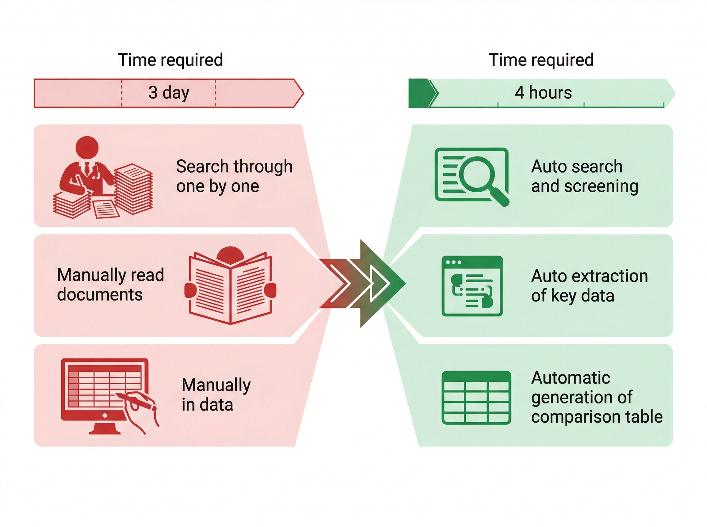
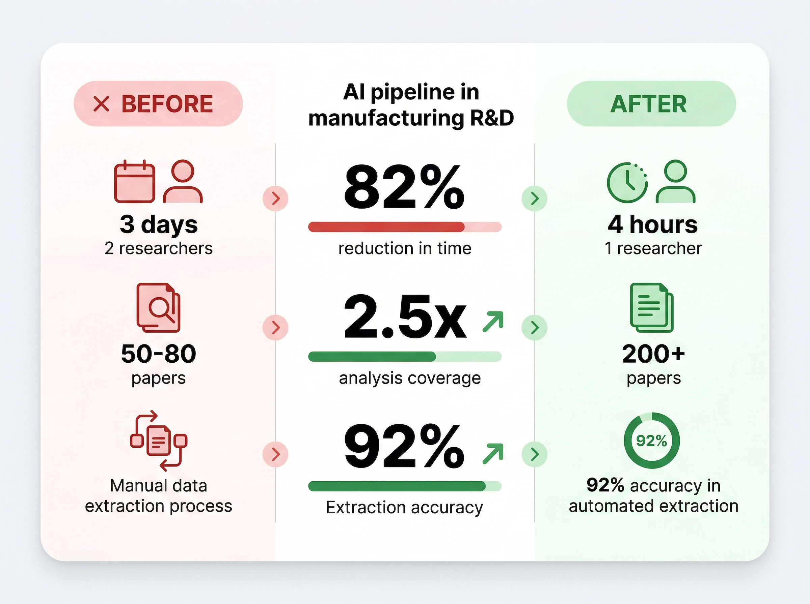

# 제조 R&D 기술 문서 분석, 3일에서 4시간으로 — 실제 AX 사례

수작업으로 3일이 걸리던 기술 문서 분석. AI 파이프라인 도입 후 4시간으로 줄었습니다.

한 중견 제조기업 R&D팀에서 실제로 일어난 변화입니다. 특별한 기술력이 아니라, 업무 프로세스를 정확히 재설계한 결과였습니다.

&nbsp;

## 제조 R&D가 직면한 현실

제조업 R&D의 경쟁력은 속도입니다. 신소재 개발, 공정 최적화, 특허 분석 — 모든 영역에서 "누가 먼저 파악하고, 먼저 의사결정하는가"가 승패를 가릅니다.

그런데 현실은 어떨까요? R&D 인력의 상당 시간이 논문 검색, 특허 문서 분석, 실험 데이터 정리 같은 **반복적 정보 처리 작업**에 묶여 있습니다. 정작 핵심인 "해석하고 판단하는 일"에 쏟을 시간이 부족하죠.

글로벌 경쟁사들은 이미 AI로 이 병목을 뚫고 있습니다. R&D 속도의 격차는 곧 시장 선점의 격차로 이어집니다.

&nbsp;

## 3일짜리 작업이 반복되고 있었다

이 기업의 R&D팀은 신소재 개발 프로젝트를 진행할 때마다 같은 패턴에 빠졌습니다.

**기술 동향 파악에만 3일.** 관련 논문 50~100편을 검색하고, 하나씩 읽으며 핵심을 추출하고, 엑셀에 정리하는 작업. 연구원 2명이 붙어서 꼬박 3일을 써야 했습니다.

문제는 이게 한 번으로 끝나지 않는다는 점이었습니다. 프로젝트마다, 신소재 후보가 바뀔 때마다 이 3일이 반복됐죠. 연간으로 환산하면 연구원 1명의 업무 시간 중 30% 이상이 "읽고 정리하는 일"에 소모되고 있었습니다.

기존에 시도한 방법도 있었습니다. 키워드 기반 논문 검색 도구를 도입했지만, 검색은 빨라져도 "읽고 판단하는 단계"는 여전히 수작업이었습니다.

&nbsp;

&nbsp;

## 이렇게 해결했다

매직에꼴 AX 컨설팅팀은 이 문제를 3단계로 접근했습니다.

&nbsp;

### 1단계: 업무 프로세스 해부

먼저 "기술 문서 분석"이라는 뭉뚱그려진 업무를 세부 단계로 분해했습니다.

논문 검색 → 1차 스크리닝(관련성 판별) → 본문 읽기 → 핵심 정보 추출 → 비교 정리 → 인사이트 도출

이 중 AI가 대체할 수 있는 단계와 사람이 해야 하는 단계를 명확히 구분했습니다.

&nbsp;

### 2단계: AI 파이프라인 설계

각 단계에 맞는 AI 모듈을 설계했습니다.

- **자동 검색 + 1차 스크리닝**: 키워드와 연구 맥락을 입력하면 관련 논문을 수집하고, 초록 기반으로 관련성을 자동 판별
- **핵심 정보 추출**: 선별된 논문에서 소재 특성, 실험 조건, 성과 데이터를 구조화된 형태로 자동 추출
- **비교 분석표 자동 생성**: 추출된 데이터를 기준별로 정리한 비교표를 자동 생성

> **핵심**: 연구원의 역할을 "읽고 정리하는 사람"에서 "검증하고 판단하는 사람"으로 전환한 것이 이 솔루션의 차별점입니다.

&nbsp;

### 3단계: 현장 검증 + 피드백 루프

2주간 파일럿을 운영하며 연구원들의 피드백을 반영했습니다. 추출 정확도를 올리고, 비교표 항목을 실무에 맞게 커스터마이징하는 과정을 거쳤습니다.

&nbsp;

## Before/After — 숫자로 확인하다

&nbsp;

정량적 성과 외에 연구원들의 반응도 주목할 만했습니다.

"이제 논문 읽는 데 시간 쓰는 게 아니라, 논문에서 뭘 가져올지 판단하는 데 집중할 수 있게 됐습니다."

실제로 파일럿 이후 3개월간, 이 팀의 신소재 후보 검토 속도가 기존 대비 2배 이상 빨라졌습니다.

&nbsp;

## 이 사례에서 배울 수 있는 것

이 사례가 특별한 건 첨단 기술을 썼기 때문이 아닙니다. 3가지 원칙을 지켰기 때문입니다.

**첫째, AI를 넣기 전에 업무를 분해했습니다.** "기술 문서 분석을 AI로 하자"가 아니라, "이 업무의 6단계 중 AI가 잘하는 3단계를 자동화하자"로 접근한 거죠.

**둘째, 사람의 역할을 재정의했습니다.** AI가 대체하는 게 아니라, 사람이 더 가치 있는 일에 집중하도록 역할을 재배치했습니다.

**셋째, 현장에서 검증하고 조정했습니다.** 완벽한 시스템을 한 번에 만들지 않고, 2주 파일럿으로 현장 피드백을 반영하며 완성도를 높였습니다.

제조 R&D뿐 아니라, 반복적 정보 처리가 병목인 모든 업무에 같은 접근을 적용할 수 있습니다.

&nbsp;

## 여러분의 R&D팀은 지금 어디에 시간을 쓰고 있나요?

연구원들이 "읽고 정리하는 일"에 묶여 있다면, 그건 연구원의 문제가 아니라 프로세스의 문제입니다.

이 기업은 3개월 만에 R&D 업무 구조를 바꿨습니다. 특별한 예산이나 인력이 아니라, 정확한 진단과 설계가 있었기 때문입니다.

매직에꼴은 50여 개 기업의 AX 전략을 지원하며, 업종별 업무 프로세스에 AI를 정착시킨 경험을 축적해왔습니다. "AI 도입"이 아니라 "AI가 작동하는 구조"를 만드는 것 — 그게 우리가 하는 일입니다.

---

> **우리 R&D팀의 업무, AI로 어디까지 바꿀 수 있을까요?**
> [매직에꼴 AX 컨설팅 알아보기 ->](https://ax-inquiry-system.vercel.app/inquiry)

---

**참고 자료**
- [프리뷰용 샘플 — 실제 발행 시 내부 브리핑 기반으로 교체]
