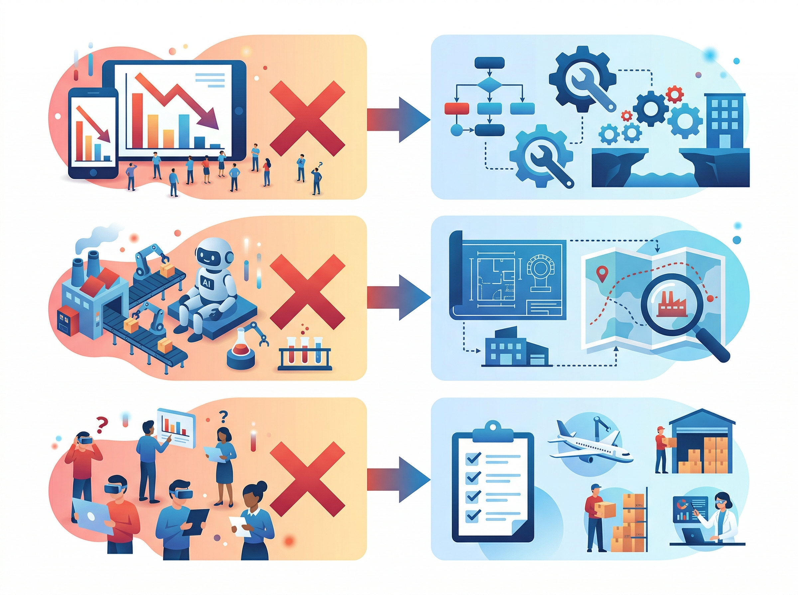
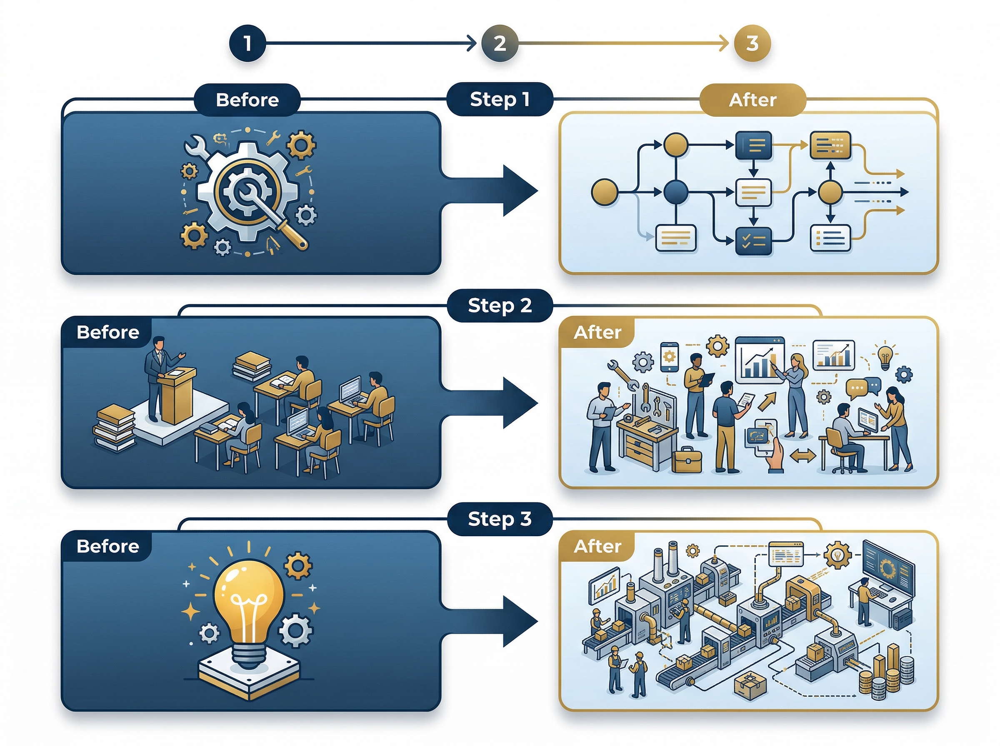

# AI 도입했는데 달라진 게 없다면, 문제는 AI가 아닙니다

작년에 AI를 도입한 기업 10곳 중 7곳이 "기대만큼의 변화를 체감하지 못한다"고 답했습니다. 도구는 들여왔는데 업무는 그대로. 교육도 했는데 현장에선 아무도 안 쓰는 상황.

혹시 여러분의 조직도 비슷한 상황은 아닌가요?

흥미로운 점은, 이 기업들이 도입한 AI 도구 자체에는 문제가 없었다는 겁니다. 진짜 원인은 전혀 다른 곳에 있었습니다.

&nbsp;

&nbsp;

## AI를 도입했는데 왜 아무것도 안 변하는가

현장에서 가장 많이 듣는 이야기는 이렇습니다.

"ChatGPT 라이선스 깔아줬는데 아무도 안 써요."

"PoC는 성공했다는데, 그 다음이 없어요."

"AI 교육 3회 했는데 현업 적용률이 5%도 안 됩니다."

&nbsp;

이건 단순히 직원들이 새로운 걸 싫어해서가 아닙니다. 도구를 깔아두는 것과 업무 방식이 바뀌는 것 사이에는 거대한 간극이 존재하죠.

그리고 이 간극을 무시한 채 "일단 도입하면 알아서 쓰겠지"라고 생각하는 순간, AI 투자는 매몰 비용이 됩니다.

&nbsp;

## 도구가 아니라 구조가 문제다

대부분의 기업이 AI 도입을 "도구 교체"로 접근합니다. 엑셀 대신 AI 분석 도구를 쓰고, 수동 검색 대신 RAG 시스템을 넣는 식이죠.

그런데 도구만 바꾸고 업무 프로세스, 의사결정 구조, 성과 평가 기준은 그대로 두면 어떻게 될까요?

&nbsp;

| 구분 | 표면적 원인 | 진짜 원인 |
|---|---|---|
| 활용률 저조 | "직원들이 변화를 싫어함" | 기존 업무 프로세스에 AI가 끼어들 자리가 없음 |
| PoC 이후 정체 | "확산 예산이 부족함" | PoC 결과를 실무 프로세스에 연결하는 설계가 없음 |
| 교육 효과 없음 | "교육 내용이 어려움" | 교육 후 적용할 구체적 업무 시나리오가 정의되지 않음 |

&nbsp;

여러분의 조직에서도 비슷한 패턴이 보이지 않나요?

본질적으로, AI 도입의 실패는 기술의 실패가 아니라 **변화관리의 실패**입니다. AI라는 새로운 엔진을 달아놓고, 도로는 예전 그대로 놔둔 셈이죠.

&nbsp;

## 핵심은 "업무 재설계"다

> **핵심**: AI 도입의 성패는 도구 선택이 아니라, AI가 작동할 수 있는 업무 구조를 만드는 데 달려 있다.

&nbsp;

성공하는 기업들의 공통점은 명확합니다. AI를 도입하기 전에, 또는 도입과 동시에 **업무 프로세스 자체를 재설계**합니다.

&nbsp;

&nbsp;

"어떤 업무에, 어떤 단계에서, AI가 어떤 역할을 하는가"를 명확히 정의하는 거죠. 이게 없으면 AI는 그냥 또 하나의 안 쓰는 소프트웨어가 됩니다.

구체적으로 3가지 전환이 필요합니다.

**첫째, 도구 중심에서 프로세스 중심으로.** AI를 "쓸 수 있는 곳"이 아니라 "반드시 써야 하는 단계"에 배치합니다. 선택이 아니라 프로세스의 일부로 만드는 겁니다.

**둘째, 일회성 교육에서 업무 내재화로.** "AI 사용법"을 가르치는 게 아니라, "이 업무를 AI로 처리하는 방법"을 가르칩니다. 추상적 기능 교육이 아니라 구체적 업무 시나리오 훈련이죠.

**셋째, PoC 성공에서 운영 설계로.** "가능하다"를 증명하는 데서 멈추지 않고, "매일 돌아가는 구조"를 설계합니다. PoC와 실운영 사이의 다리를 놓는 겁니다.

&nbsp;

## 지금 바로 이렇게 시작하라

이론은 충분합니다. 오늘 당장 시작할 수 있는 3가지 액션을 제안합니다.

&nbsp;

> **실행 포인트 1: 업무 프로세스 맵을 펼쳐놓고 "AI가 들어갈 자리"를 표시하라.**
> 팀의 주요 업무 흐름을 5~7단계로 정리하고, 각 단계에서 AI가 대체/보조할 수 있는 부분을 구체적으로 지정합니다. "AI 활용"이라는 막연한 목표가 "3단계 데이터 수집을 AI로 자동화"라는 명확한 과제로 바뀝니다.

&nbsp;

> **실행 포인트 2: "AI 없이는 안 되는" 업무 시나리오 3개를 만들어라.**
> AI를 선택 사항이 아니라 필수 단계로 만드는 겁니다. 예를 들어, 보고서 초안을 AI로 먼저 생성한 뒤 검토하는 프로세스를 공식화하면, 자연스럽게 활용률이 올라갑니다.

&nbsp;

> **실행 포인트 3: PoC 결과물에 "운영 설계서"를 붙여라.**
> PoC가 끝나면 "성공/실패" 판정에서 멈추지 말고, "이걸 매일 돌리려면 무엇이 필요한가"를 정리한 운영 설계서를 작성합니다. 담당자, 데이터 파이프라인, 예외 처리 절차까지 포함해야 합니다.

&nbsp;

이 3가지를 실행하는 것만으로도, AI가 "도입한 도구"에서 "작동하는 시스템"으로 전환되는 첫 단계를 밟게 됩니다.

하지만 업무 재설계는 혼자 하기엔 복잡합니다. 어디서부터 손대야 할지, 우리 업종에 맞는 AI 적용 포인트가 어디인지, 현장을 아는 전문가의 눈이 필요한 순간이 있죠.

---

> **우리 조직의 AI, 도구에서 시스템으로 전환할 준비가 되셨나요?**
> [매직에꼴 AX 컨설팅 알아보기 ->](https://ax-inquiry-system.vercel.app/inquiry)

---

**참고 자료**
- [프리뷰용 샘플 — 실제 발행 시 소스 기반 참고 자료로 교체]
